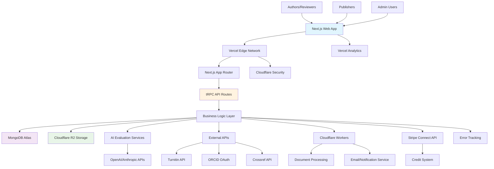
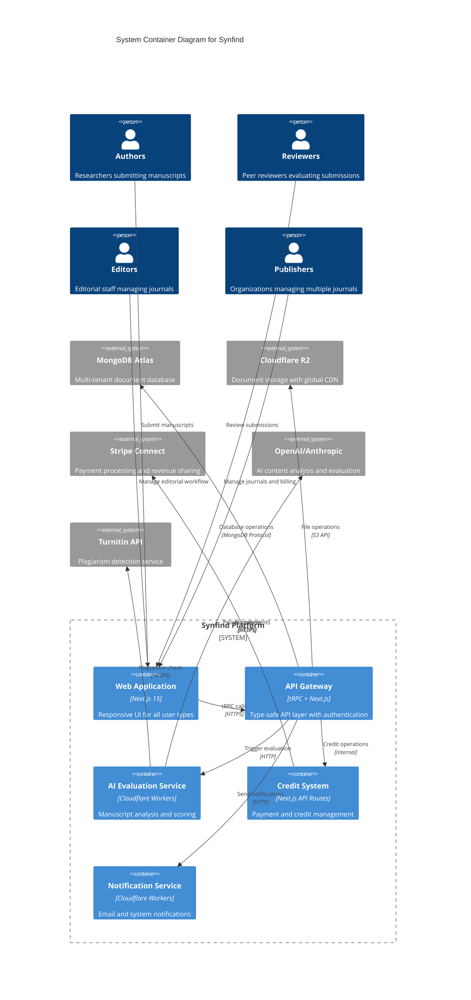
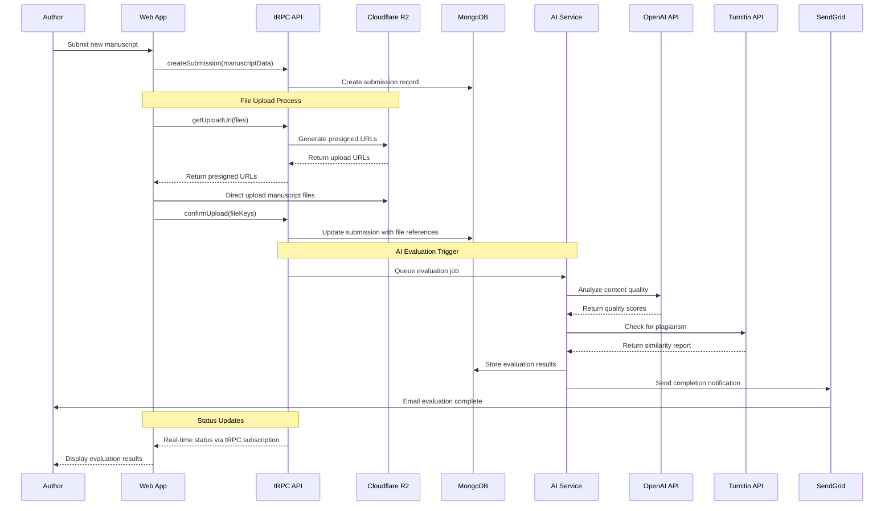
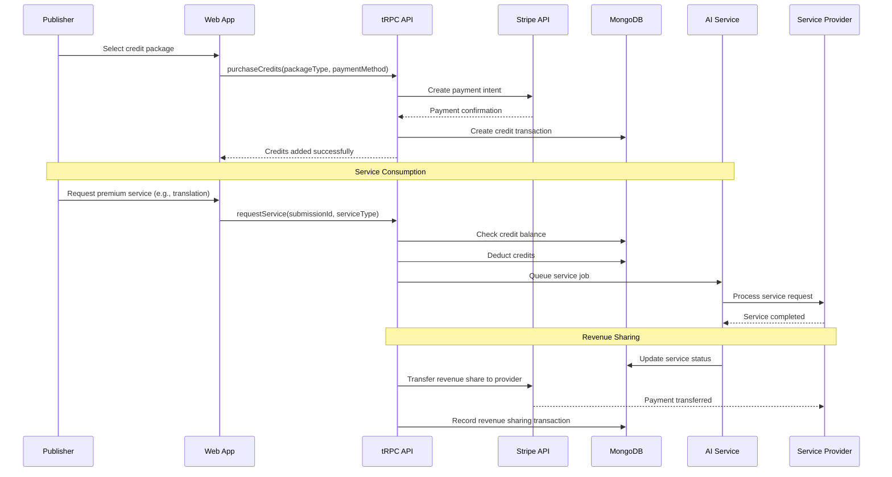
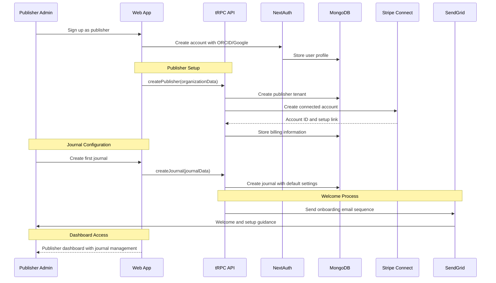
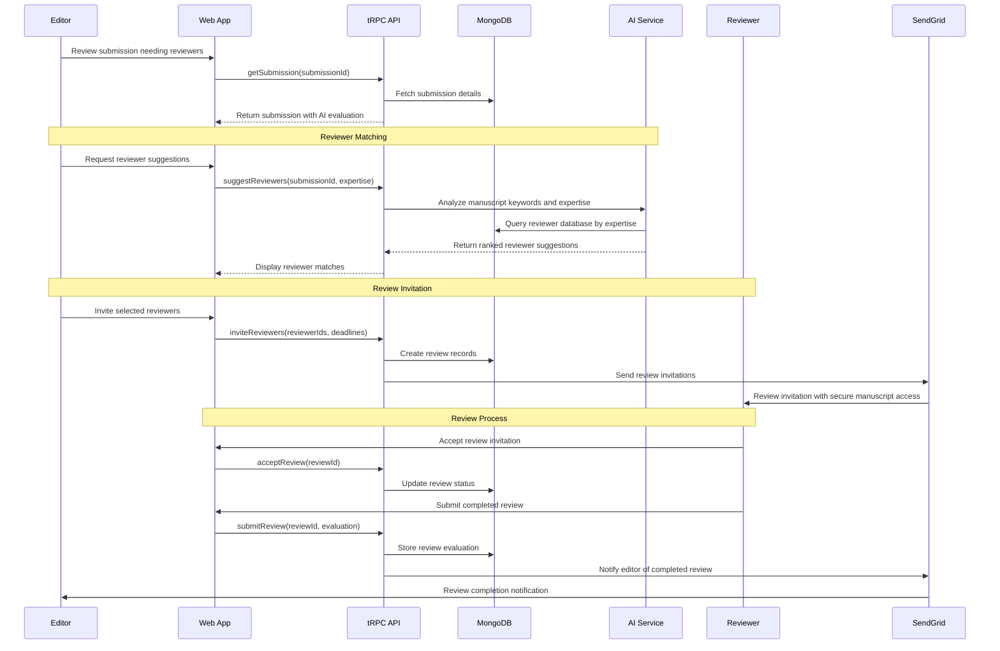
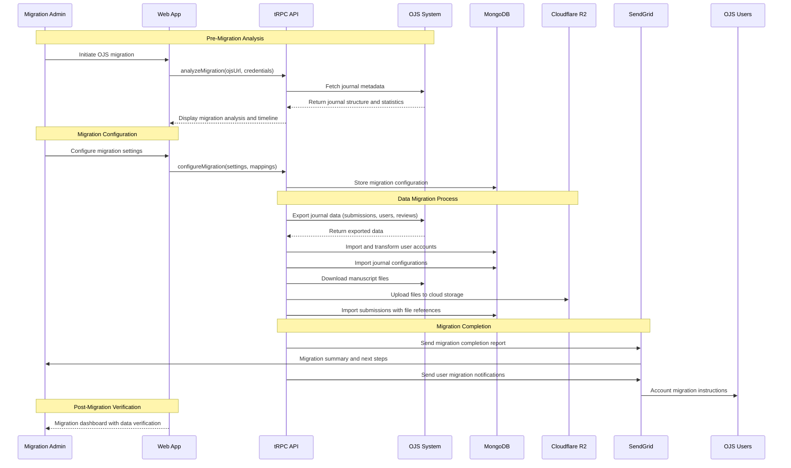
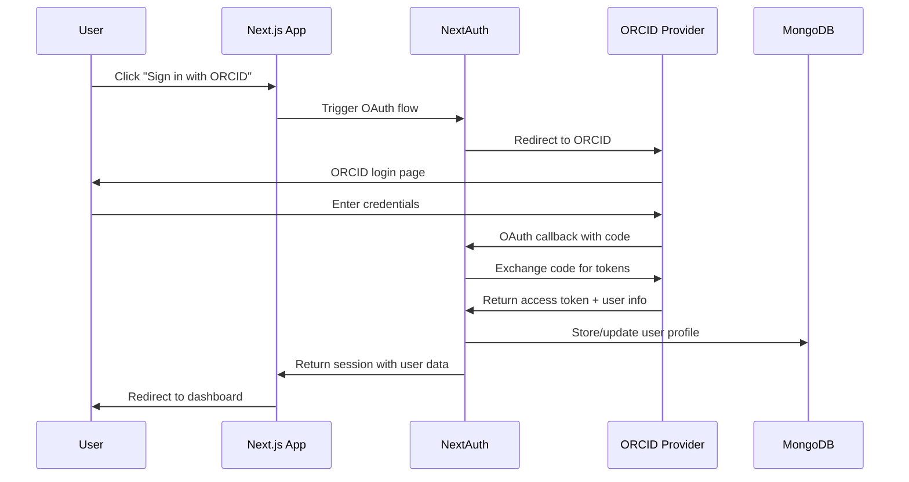
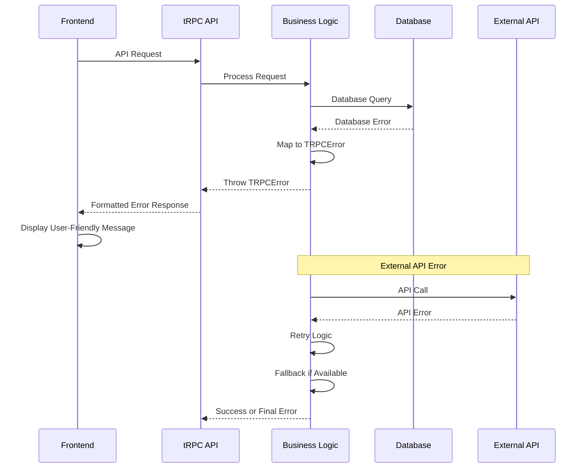

# Synfind (ScholaryHub) Fullstack Architecture Document

This document outlines the complete fullstack architecture for Synfind (ScholaryHub), including backend systems, frontend implementation, and their integration. It serves as the single source of truth for AI-driven development, ensuring consistency across the entire technology stack.

This unified approach combines what would traditionally be separate backend and frontend architecture documents, streamlining the development process for modern fullstack applications where these concerns are increasingly intertwined.

## Starter Template or Existing Project

**Template Selection: T3 Stack + Enhanced Academic Publishing Features**

Based on the brief's requirements for Next.js 15, TypeScript, and comprehensive full-stack architecture, I recommend starting with the **T3 Stack** as the foundation with significant extensions:

- **Base:** T3 Stack (Next.js 15 + TypeScript + tRPC + Tailwind + NextAuth)
- **Enhanced for Academic Publishing:** Custom AI evaluation services, document processing, multi-tenant architecture
- **Platform-specific:** Optimized for Vercel deployment with Cloudflare R2 integration

**Rationale:** T3 Stack provides type-safe full-stack development with modern best practices, which aligns perfectly with Synfind's need for reliability and scalability in the academic publishing domain.

## Change Log

| Date | Version | Description | Author |
|------|---------|-------------|--------|
| 2025-09-01 | 1.0 | Initial fullstack architecture for Synfind | Winston (Architect) |

## High Level Architecture

### Technical Summary

Synfind employs a modern serverless-first architecture built on Next.js 15 with App Router, utilizing tRPC for type-safe API communications and MongoDB Atlas for multi-tenant data storage. The frontend leverages shadcn/ui components with Tailwind CSS for rapid, accessible interface development, while the backend implements microservice patterns through Vercel Edge Functions and Cloudflare Workers for document processing. Key integration points include NextAuth v5 for authentication, Cloudflare R2 for scalable document storage, and external APIs for AI evaluation services. This architecture achieves the PRD's goals of supporting 500+ journals by Year 3 through horizontal scaling, credit-based service marketplace through integrated payment processing, and AI-powered evaluation through modular service architecture.

### Platform and Infrastructure Choice

**Platform:** Vercel + Cloudflare + MongoDB Atlas  
**Key Services:** Vercel (hosting/edge functions), Cloudflare R2 (document storage), MongoDB Atlas (database), Stripe (payments), OpenAI/Anthropic (AI services)  
**Deployment Host and Regions:** Global edge deployment via Vercel with primary regions: US-East, EU-West, Asia-Pacific

**Rationale:** This combination provides optimal performance for global academic publishing with edge computing for document processing, enterprise-grade database scaling, and integrated CDN for document delivery.

### Repository Structure

**Structure:** Turborepo monorepo  
**Monorepo Tool:** Turborepo (optimal for Vercel deployment)  
**Package Organization:** Apps (web, api workers), packages (shared types, ui components, database schemas), services (external integrations)

### High Level Architecture Diagram



### Architectural Patterns

- **Jamstack Architecture:** Next.js SSG/ISR with serverless APIs - _Rationale:_ Optimal performance and global scale for content-heavy academic publishing platform
- **Multi-Tenant SaaS Pattern:** Schema-per-tenant with tenant isolation - _Rationale:_ Ensures data privacy between publishers while maintaining operational efficiency
- **Microservices via Serverless:** Domain-specific edge functions and workers - _Rationale:_ Enables independent scaling of AI evaluation, document processing, and business logic
- **Event-Driven Architecture:** Async processing for document analysis and notifications - _Rationale:_ Handles long-running AI evaluation tasks without blocking user interactions
- **Repository Pattern:** Abstracted data access with MongoDB - _Rationale:_ Enables testing and future database optimization while maintaining type safety
- **API-First Design:** tRPC for type-safe client-server communication - _Rationale:_ Reduces integration bugs and improves developer experience in fullstack development
- **Credit-Based Service Pattern:** Transactional service consumption model - _Rationale:_ Enables flexible pricing and revenue sharing with service providers

## Tech Stack

### Technology Stack Table

| Category | Technology | Version | Purpose | Rationale |
|----------|------------|---------|---------|-----------|
| Frontend Language | TypeScript | 5.3+ | Type-safe frontend development | Academic publishing requires high reliability and complex data structures |
| Frontend Framework | Next.js | 15.x | React-based full-stack framework | App Router provides modern routing, SSR/SSG for performance, built-in API routes |
| UI Component Library | shadcn/ui | Latest | Accessible, customizable React components | Academic accessibility requirements, rapid development, consistent design system |
| State Management | Zustand + TanStack Query | Latest | Client state + server state management | Simple global state + powerful server state caching for complex academic data |
| Backend Language | TypeScript | 5.3+ | Type-safe backend development | Shared types between frontend/backend, reduced runtime errors |
| Backend Framework | Next.js API Routes + tRPC | 15.x + Latest | Type-safe API layer | End-to-end type safety, excellent DX, integrated with Next.js |
| API Style | tRPC | Latest | Type-safe RPC-style APIs | Eliminates API documentation drift, compile-time API contract validation |
| Database | MongoDB Atlas | 7.0+ | Document database for academic content | Flexible schema for diverse journal types, built-in full-text search, global clustering |
| Cache | Redis (Upstash) | Latest | Session and API response caching | Serverless-compatible Redis for session management and API performance |
| File Storage | Cloudflare R2 | Latest | Scalable document storage | Academic document storage with global CDN, S3-compatible API, cost-effective |
| Authentication | NextAuth.js | v5 | Multi-provider authentication | ORCID integration, institutional SSO, social logins for academic users |
| Frontend Testing | Vitest + Testing Library | Latest | Fast unit/integration testing | Vite-based testing for Next.js, excellent TypeScript support |
| Backend Testing | Vitest + Supertest | Latest | API endpoint testing | Consistent testing framework across frontend/backend |
| E2E Testing | Playwright | Latest | End-to-end testing | Academic workflow complexity requires robust E2E testing |
| Build Tool | Turborepo | Latest | Monorepo build orchestration | Optimized for Vercel, efficient caching, parallel builds |
| Bundler | Next.js (Webpack/Turbopack) | Built-in | Optimized bundling | Integrated bundling with Next.js optimizations |
| IaC Tool | Vercel CLI + Terraform | Latest | Infrastructure as code | Vercel deployment + external resource management |
| CI/CD | GitHub Actions | Latest | Continuous integration/deployment | Native GitHub integration, Vercel deployment hooks |
| Monitoring | Vercel Analytics + Sentry | Latest | Performance and error monitoring | Built-in Vercel monitoring + comprehensive error tracking |
| Logging | Vercel Functions + Axiom | Latest | Structured logging | Serverless-compatible logging with search and analytics |
| CSS Framework | Tailwind CSS | 3.x | Utility-first styling | Rapid development, consistent design system, excellent with shadcn/ui |

## Data Models

Based on the Synfind brief requirements, here are the core data models for the academic publishing platform:

### Publisher

**Purpose:** Root tenant entity managing multiple journals with organizational hierarchy and billing

**Key Attributes:**
- id: string - Unique publisher identifier
- name: string - Publisher organization name  
- domain: string - Custom domain for white-label access
- subscriptionTier: enum - Current subscription level (starter, professional, enterprise)
- billingInfo: object - Stripe customer and subscription details
- settings: object - Publisher-wide configuration and branding

#### TypeScript Interface

```typescript
interface Publisher {
  id: string;
  name: string;
  slug: string;
  domain?: string;
  subscriptionTier: 'starter' | 'professional' | 'enterprise';
  creditBalance: number;
  billingInfo: {
    stripeCustomerId: string;
    subscriptionId?: string;
    billingEmail: string;
  };
  settings: {
    branding: {
      logoUrl?: string;
      primaryColor: string;
      secondaryColor: string;
    };
    defaultLanguage: string;
    timezone: string;
  };
  createdAt: Date;
  updatedAt: Date;
}
```

#### Relationships
- One-to-many with Journal entities
- One-to-many with User entities (publisher staff)
- One-to-many with CreditTransaction entities

### Journal

**Purpose:** Individual journal configuration within a publisher, managing editorial workflow and submission settings

**Key Attributes:**
- id: string - Unique journal identifier
- publisherId: string - Parent publisher reference
- title: string - Journal name and ISSN details
- submissionSettings: object - Submission workflow configuration
- aiEvaluationSettings: object - AI screening preferences and thresholds

#### TypeScript Interface

```typescript
interface Journal {
  id: string;
  publisherId: string;
  title: string;
  issn?: string;
  slug: string;
  description: string;
  scope: string;
  submissionSettings: {
    acceptedFileTypes: string[];
    maxFileSize: number;
    requiresAbstract: boolean;
    requiresKeywords: boolean;
    minKeywords: number;
    maxKeywords: number;
  };
  aiEvaluationSettings: {
    enableInitialScreening: boolean;
    plagiarismThreshold: number;
    aiContentThreshold: number;
    noveltyThreshold: number;
    autoRejectBelow: number;
    autoAcceptAbove: number;
  };
  editorialBoard: {
    editorInChief: string; // User ID
    associateEditors: string[];
    reviewingEditors: string[];
  };
  status: 'active' | 'inactive' | 'archived';
  createdAt: Date;
  updatedAt: Date;
}
```

#### Relationships
- Many-to-one with Publisher entity
- One-to-many with Submission entities
- Many-to-many with User entities (editorial roles)

### Submission

**Purpose:** Core manuscript entity tracking complete submission lifecycle from author upload through publication decision

**Key Attributes:**
- id: string - Unique submission identifier
- journalId: string - Target journal reference
- authorId: string - Submitting author reference
- manuscriptData: object - Title, abstract, keywords, and metadata
- files: array - Document files and supplementary materials
- status: enum - Current workflow status
- aiEvaluationResults: object - AI screening scores and recommendations

#### TypeScript Interface

```typescript
interface Submission {
  id: string;
  journalId: string;
  authorId: string;
  submissionNumber: string; // Human-readable identifier
  manuscriptData: {
    title: string;
    abstract: string;
    keywords: string[];
    manuscriptType: 'research-article' | 'review' | 'case-study' | 'editorial';
    wordCount: number;
    language: string;
  };
  authors: Array<{
    userId?: string;
    name: string;
    email: string;
    affiliation: string;
    orcid?: string;
    isCorresponding: boolean;
    contributionRoles: string[];
  }>;
  files: Array<{
    id: string;
    type: 'manuscript' | 'figure' | 'table' | 'supplementary';
    filename: string;
    size: number;
    r2Key: string; // Cloudflare R2 object key
    uploadedAt: Date;
  }>;
  status: 'submitted' | 'under-initial-review' | 'under-peer-review' | 
          'revision-requested' | 'accepted' | 'rejected' | 'withdrawn';
  aiEvaluationResults?: {
    overallScore: number;
    noveltyScore: number;
    methodologyScore: number;
    integrityScore: number;
    plagiarismScore: number;
    aiContentScore: number;
    recommendation: 'accept' | 'review' | 'reject';
    completedAt: Date;
    reportUrl?: string;
  };
  reviewRounds: ReviewRound[];
  creditTransactions: string[]; // IDs of credit transactions for services
  submittedAt: Date;
  updatedAt: Date;
}
```

#### Relationships
- Many-to-one with Journal entity
- Many-to-one with User entity (author)
- One-to-many with ReviewRound entities
- One-to-many with CreditTransaction entities

### User

**Purpose:** Unified user entity supporting multiple roles (authors, reviewers, editors, publishers) with role-based permissions

**Key Attributes:**
- id: string - Unique user identifier
- profile: object - Personal and professional information
- roles: array - Role assignments across different publishers/journals
- preferences: object - User interface and notification preferences
- expertise: array - Research areas and keywords for reviewer matching

#### TypeScript Interface

```typescript
interface User {
  id: string;
  email: string;
  profile: {
    firstName: string;
    lastName: string;
    displayName?: string;
    title?: string;
    affiliation?: string;
    orcid?: string;
    profileImageUrl?: string;
    bio?: string;
  };
  roles: Array<{
    publisherId?: string;
    journalId?: string;
    role: 'author' | 'reviewer' | 'editor' | 'publisher-admin' | 'super-admin';
    permissions: string[];
    assignedAt: Date;
  }>;
  expertise: Array<{
    subject: string;
    keywords: string[];
    confidenceLevel: 1 | 2 | 3 | 4 | 5;
  }>;
  preferences: {
    language: string;
    timezone: string;
    emailNotifications: {
      submissionUpdates: boolean;
      reviewInvitations: boolean;
      editorialNotifications: boolean;
      systemAnnouncements: boolean;
    };
    reviewPreferences: {
      maxActiveReviews: number;
      preferredReviewTime: number; // days
      specializations: string[];
    };
  };
  accountStatus: 'active' | 'inactive' | 'suspended';
  lastLoginAt?: Date;
  createdAt: Date;
  updatedAt: Date;
}
```

#### Relationships
- Many-to-many with Publisher entities (via roles)
- Many-to-many with Journal entities (via roles)
- One-to-many with Submission entities (as author)
- One-to-many with Review entities (as reviewer)

### CreditTransaction

**Purpose:** Track credit purchases, consumption, and revenue sharing for the service marketplace economy

**Key Attributes:**
- id: string - Unique transaction identifier
- publisherId: string - Publisher account reference
- type: enum - Transaction type (purchase, consumption, refund)
- amount: number - Credit amount (positive for purchases, negative for consumption)
- serviceType: string - Type of service consumed (if applicable)
- metadata: object - Transaction-specific details and references

#### TypeScript Interface

```typescript
interface CreditTransaction {
  id: string;
  publisherId: string;
  type: 'purchase' | 'consumption' | 'refund' | 'bonus' | 'transfer';
  amount: number; // Credits (can be negative for consumption)
  costInUSD: number; // Monetary value
  serviceType?: 'similarity-check' | 'ai-detection' | 'translation' | 
               'infographic' | 'express-review' | 'citation-prediction';
  relatedEntityId?: string; // Submission ID, Service Request ID, etc.
  metadata: {
    stripePaymentIntentId?: string;
    submissionId?: string;
    serviceProviderId?: string;
    revenueSharing?: {
      platformShare: number;
      providerShare: number;
      reviewerShare?: number;
    };
    packageInfo?: {
      packageType: string;
      bonusCredits: number;
      discountPercent: number;
    };
  };
  status: 'pending' | 'completed' | 'failed' | 'refunded';
  processedAt?: Date;
  createdAt: Date;
}
```

#### Relationships
- Many-to-one with Publisher entity
- Many-to-one with Submission entity (for service consumption)

## API Specification

Based on the tRPC selection from the Tech Stack, here's the comprehensive tRPC router definition for Synfind:

### tRPC Router Definitions

```typescript
import { z } from 'zod';
import { createTRPCRouter, protectedProcedure, publicProcedure } from '~/server/api/trpc';

// Authentication router
export const authRouter = createTRPCRouter({
  getSession: publicProcedure.query(async ({ ctx }) => {
    return ctx.session;
  }),

  signOut: protectedProcedure.mutation(async ({ ctx }) => {
    await ctx.auth.signOut();
    return { success: true };
  }),
});

// Publisher management router
export const publisherRouter = createTRPCRouter({
  getProfile: protectedProcedure
    .query(async ({ ctx }) => {
      return await ctx.db.publisher.findUnique({
        where: { id: ctx.session.user.publisherId },
        include: { journals: true, creditBalance: true }
      });
    }),

  updateSettings: protectedProcedure
    .input(z.object({
      name: z.string().optional(),
      branding: z.object({
        logoUrl: z.string().optional(),
        primaryColor: z.string(),
        secondaryColor: z.string(),
      }).optional(),
    }))
    .mutation(async ({ input, ctx }) => {
      return await ctx.db.publisher.update({
        where: { id: ctx.session.user.publisherId },
        data: input
      });
    }),

  getCreditBalance: protectedProcedure
    .query(async ({ ctx }) => {
      const transactions = await ctx.db.creditTransaction.aggregate({
        where: { publisherId: ctx.session.user.publisherId },
        _sum: { amount: true }
      });
      return { balance: transactions._sum.amount || 0 };
    }),

  purchaseCredits: protectedProcedure
    .input(z.object({
      packageType: z.enum(['starter', 'professional', 'premium', 'enterprise']),
      paymentMethodId: z.string(),
    }))
    .mutation(async ({ input, ctx }) => {
      // Stripe payment processing and credit allocation logic
      const packageDetails = getCreditPackageDetails(input.packageType);
      const paymentIntent = await ctx.stripe.paymentIntents.create({
        amount: packageDetails.costInCents,
        currency: 'usd',
        payment_method: input.paymentMethodId,
        confirm: true,
      });
      
      if (paymentIntent.status === 'succeeded') {
        return await ctx.db.creditTransaction.create({
          data: {
            publisherId: ctx.session.user.publisherId,
            type: 'purchase',
            amount: packageDetails.totalCredits,
            costInUSD: packageDetails.costInUSD,
            metadata: { 
              stripePaymentIntentId: paymentIntent.id,
              packageInfo: packageDetails 
            },
            status: 'completed',
            processedAt: new Date(),
          }
        });
      }
    }),
});

// Journal management router
export const journalRouter = createTRPCRouter({
  getAll: protectedProcedure
    .query(async ({ ctx }) => {
      return await ctx.db.journal.findMany({
        where: { publisherId: ctx.session.user.publisherId },
        include: { _count: { select: { submissions: true } } }
      });
    }),

  getById: protectedProcedure
    .input(z.object({ id: z.string() }))
    .query(async ({ input, ctx }) => {
      return await ctx.db.journal.findUnique({
        where: { id: input.id },
        include: {
          editorialBoard: true,
          submissions: { 
            take: 10, 
            orderBy: { submittedAt: 'desc' }
          }
        }
      });
    }),

  create: protectedProcedure
    .input(z.object({
      title: z.string(),
      issn: z.string().optional(),
      description: z.string(),
      scope: z.string(),
      submissionSettings: z.object({
        acceptedFileTypes: z.array(z.string()),
        maxFileSize: z.number(),
        requiresAbstract: z.boolean(),
        requiresKeywords: z.boolean(),
        minKeywords: z.number(),
        maxKeywords: z.number(),
      }),
    }))
    .mutation(async ({ input, ctx }) => {
      return await ctx.db.journal.create({
        data: {
          ...input,
          publisherId: ctx.session.user.publisherId,
          slug: generateSlug(input.title),
          aiEvaluationSettings: getDefaultAISettings(),
        }
      });
    }),

  updateAISettings: protectedProcedure
    .input(z.object({
      journalId: z.string(),
      settings: z.object({
        enableInitialScreening: z.boolean(),
        plagiarismThreshold: z.number().min(0).max(100),
        aiContentThreshold: z.number().min(0).max(100),
        noveltyThreshold: z.number().min(0).max(100),
        autoRejectBelow: z.number().min(0).max(100),
        autoAcceptAbove: z.number().min(0).max(100),
      })
    }))
    .mutation(async ({ input, ctx }) => {
      return await ctx.db.journal.update({
        where: { id: input.journalId },
        data: { aiEvaluationSettings: input.settings }
      });
    }),
});

// Submission management router
export const submissionRouter = createTRPCRouter({
  getAll: protectedProcedure
    .input(z.object({
      journalId: z.string().optional(),
      status: z.enum(['submitted', 'under-initial-review', 'under-peer-review', 
                     'revision-requested', 'accepted', 'rejected', 'withdrawn']).optional(),
      page: z.number().default(1),
      limit: z.number().default(20),
    }))
    .query(async ({ input, ctx }) => {
      const where = {
        ...(input.journalId && { journalId: input.journalId }),
        ...(input.status && { status: input.status }),
        journal: { publisherId: ctx.session.user.publisherId }
      };
      
      const submissions = await ctx.db.submission.findMany({
        where,
        include: {
          journal: { select: { title: true } },
          authors: true,
          aiEvaluationResults: true,
        },
        skip: (input.page - 1) * input.limit,
        take: input.limit,
        orderBy: { submittedAt: 'desc' }
      });
      
      const total = await ctx.db.submission.count({ where });
      
      return { submissions, total, pages: Math.ceil(total / input.limit) };
    }),

  getById: protectedProcedure
    .input(z.object({ id: z.string() }))
    .query(async ({ input, ctx }) => {
      return await ctx.db.submission.findUnique({
        where: { id: input.id },
        include: {
          journal: true,
          authors: true,
          files: true,
          aiEvaluationResults: true,
          reviewRounds: {
            include: { reviews: true }
          },
          creditTransactions: true,
        }
      });
    }),

  create: protectedProcedure
    .input(z.object({
      journalId: z.string(),
      manuscriptData: z.object({
        title: z.string(),
        abstract: z.string(),
        keywords: z.array(z.string()),
        manuscriptType: z.enum(['research-article', 'review', 'case-study', 'editorial']),
        language: z.string().default('en'),
      }),
      authors: z.array(z.object({
        name: z.string(),
        email: z.string().email(),
        affiliation: z.string(),
        orcid: z.string().optional(),
        isCorresponding: z.boolean(),
        contributionRoles: z.array(z.string()),
      })),
      fileIds: z.array(z.string()), // Pre-uploaded file IDs
    }))
    .mutation(async ({ input, ctx }) => {
      const submissionNumber = await generateSubmissionNumber(input.journalId);
      
      const submission = await ctx.db.submission.create({
        data: {
          ...input,
          submissionNumber,
          authorId: ctx.session.user.id,
          status: 'submitted',
          submittedAt: new Date(),
        }
      });

      // Trigger AI evaluation if enabled
      const journal = await ctx.db.journal.findUnique({
        where: { id: input.journalId },
        select: { aiEvaluationSettings: true }
      });

      if (journal?.aiEvaluationSettings.enableInitialScreening) {
        await ctx.aiEvaluationQueue.add('evaluate-submission', {
          submissionId: submission.id
        });
      }

      return submission;
    }),

  requestAIEvaluation: protectedProcedure
    .input(z.object({
      submissionId: z.string(),
      services: z.array(z.enum(['similarity-check', 'ai-detection', 'structure-validation'])),
    }))
    .mutation(async ({ input, ctx }) => {
      // Check credit balance and deduct credits
      const costs = calculateServiceCosts(input.services);
      const balance = await getCurrentCreditBalance(ctx.session.user.publisherId);
      
      if (balance < costs.total) {
        throw new TRPCError({
          code: 'BAD_REQUEST',
          message: 'Insufficient credit balance'
        });
      }

      // Create credit transaction
      await ctx.db.creditTransaction.create({
        data: {
          publisherId: ctx.session.user.publisherId,
          type: 'consumption',
          amount: -costs.total,
          costInUSD: costs.total,
          serviceType: 'ai-evaluation-services',
          relatedEntityId: input.submissionId,
          status: 'pending',
        }
      });

      // Queue AI evaluation services
      for (const service of input.services) {
        await ctx.aiEvaluationQueue.add(`evaluate-${service}`, {
          submissionId: input.submissionId,
          serviceType: service
        });
      }

      return { success: true, creditsDeducted: costs.total };
    }),

  updateStatus: protectedProcedure
    .input(z.object({
      submissionId: z.string(),
      status: z.enum(['submitted', 'under-initial-review', 'under-peer-review', 
                     'revision-requested', 'accepted', 'rejected', 'withdrawn']),
      notes: z.string().optional(),
    }))
    .mutation(async ({ input, ctx }) => {
      return await ctx.db.submission.update({
        where: { id: input.submissionId },
        data: {
          status: input.status,
          updatedAt: new Date(),
        }
      });
    }),
});

// AI Evaluation router
export const aiEvaluationRouter = createTRPCRouter({
  getResults: protectedProcedure
    .input(z.object({ submissionId: z.string() }))
    .query(async ({ input, ctx }) => {
      return await ctx.db.submission.findUnique({
        where: { id: input.submissionId },
        select: { aiEvaluationResults: true }
      });
    }),

  triggerManualEvaluation: protectedProcedure
    .input(z.object({
      submissionId: z.string(),
      evaluationType: z.enum(['full', 'plagiarism-only', 'ai-content-only']),
    }))
    .mutation(async ({ input, ctx }) => {
      await ctx.aiEvaluationQueue.add('manual-evaluation', {
        submissionId: input.submissionId,
        evaluationType: input.evaluationType,
        requestedBy: ctx.session.user.id,
      });
      
      return { success: true, message: 'Evaluation queued successfully' };
    }),
});

// File management router
export const fileRouter = createTRPCRouter({
  getUploadUrl: protectedProcedure
    .input(z.object({
      filename: z.string(),
      contentType: z.string(),
      fileSize: z.number(),
    }))
    .mutation(async ({ input, ctx }) => {
      // Generate presigned URL for Cloudflare R2 upload
      const r2Key = `submissions/${ctx.session.user.publisherId}/${uuid()}/${input.filename}`;
      const uploadUrl = await generateR2PresignedUrl(r2Key, input.contentType);
      
      return {
        uploadUrl,
        r2Key,
        expiresIn: 3600, // 1 hour
      };
    }),

  confirmUpload: protectedProcedure
    .input(z.object({
      r2Key: z.string(),
      filename: z.string(),
      fileSize: z.number(),
      contentType: z.string(),
    }))
    .mutation(async ({ input, ctx }) => {
      return await ctx.db.file.create({
        data: {
          r2Key: input.r2Key,
          filename: input.filename,
          size: input.fileSize,
          contentType: input.contentType,
          uploadedBy: ctx.session.user.id,
          uploadedAt: new Date(),
        }
      });
    }),

  getDownloadUrl: protectedProcedure
    .input(z.object({ fileId: z.string() }))
    .mutation(async ({ input, ctx }) => {
      const file = await ctx.db.file.findUnique({
        where: { id: input.fileId }
      });
      
      if (!file) {
        throw new TRPCError({
          code: 'NOT_FOUND',
          message: 'File not found'
        });
      }

      const downloadUrl = await generateR2DownloadUrl(file.r2Key);
      return { downloadUrl, expiresIn: 900 }; // 15 minutes
    }),
});

// Main app router combining all routers
export const appRouter = createTRPCRouter({
  auth: authRouter,
  publisher: publisherRouter,
  journal: journalRouter,
  submission: submissionRouter,
  aiEvaluation: aiEvaluationRouter,
  file: fileRouter,
});

export type AppRouter = typeof appRouter;
```

## Components

Based on the architectural patterns, tech stack, and data models defined above, here are the major system components:

### Web Application (Next.js Frontend)

**Responsibility:** User interface for publishers, editors, authors, and reviewers with responsive design and accessibility compliance

**Key Interfaces:**
- tRPC client for type-safe API communication
- NextAuth session management for authentication
- Cloudflare R2 direct upload for large manuscript files

**Dependencies:** Publisher Router, Journal Router, Submission Router, File Router

**Technology Stack:** Next.js 15 App Router, shadcn/ui components, Tailwind CSS, Zustand for client state, TanStack Query for server state

### API Gateway (tRPC + Next.js API Routes)

**Responsibility:** Type-safe API layer handling authentication, authorization, input validation, and business logic orchestration

**Key Interfaces:**
- REST endpoints for webhook integrations (Stripe, external services)
- tRPC procedures for frontend communication
- Database abstraction layer for data operations

**Dependencies:** Database Service, Authentication Service, AI Evaluation Service

**Technology Stack:** tRPC routers, Zod validation, NextAuth middleware, rate limiting with Upstash Redis

### Database Service (MongoDB Atlas)

**Responsibility:** Multi-tenant data storage with publisher isolation, full-text search, and academic metadata management

**Key Interfaces:**
- Mongoose ODM with TypeScript schemas
- GridFS for large document metadata storage
- Atlas Search for manuscript and author discovery

**Dependencies:** None (external managed service)

**Technology Stack:** MongoDB Atlas 7.0+, Mongoose ODM, database indexing strategies for multi-tenant queries

### Document Storage Service (Cloudflare R2)

**Responsibility:** Scalable manuscript and supplementary file storage with global CDN delivery and security controls

**Key Interfaces:**
- S3-compatible API for upload/download operations
- Presigned URLs for direct browser uploads
- Signed URLs for secure reviewer access

**Dependencies:** None (external managed service)

**Technology Stack:** Cloudflare R2, AWS SDK v3 for S3 compatibility, CDN integration for global delivery

### AI Evaluation Service (Cloudflare Workers)

**Responsibility:** Asynchronous AI-powered manuscript evaluation including plagiarism detection, content analysis, and quality scoring

**Key Interfaces:**
- Queue-based job processing for long-running tasks
- External AI API integrations (OpenAI, Anthropic, Turnitin)
- Webhook callbacks to update submission status

**Dependencies:** Document Storage Service, External AI APIs, Database Service

**Technology Stack:** Cloudflare Workers, Queue API, OpenAI/Anthropic SDK, Turnitin API integration

### Authentication Service (NextAuth.js)

**Responsibility:** Multi-provider authentication supporting ORCID, Google, institutional SSO, and role-based access control

**Key Interfaces:**
- OAuth provider integrations
- JWT token management for session persistence
- Role-based middleware for API route protection

**Dependencies:** Database Service for user/session storage

**Technology Stack:** NextAuth.js v5, ORCID OAuth provider, Google OAuth, custom database adapter

### Credit System Service

**Responsibility:** Credit purchase, consumption tracking, revenue sharing calculations, and marketplace transaction management

**Key Interfaces:**
- Stripe Connect API for payment processing
- Credit balance calculations and transaction history
- Service consumption deduction and revenue sharing

**Dependencies:** Database Service, Payment Processing (Stripe)

**Technology Stack:** Stripe SDK, transaction logging, revenue sharing algorithms, credit package configuration

### Notification Service (Cloudflare Workers)

**Responsibility:** Email notifications, system alerts, and communication management for editorial workflows

**Key Interfaces:**
- Email template management and personalization
- Multi-language support for international users
- Event-driven triggers from submission status changes

**Dependencies:** Database Service for recipient management

**Technology Stack:** Cloudflare Workers, email service integration (SendGrid/Resend), template engine

### Component Diagrams



## External APIs

Based on the Synfind brief requirements and component design, here are the critical external service integrations:

### OpenAI API

- **Purpose:** AI-powered manuscript content analysis, quality evaluation, and language processing
- **Documentation:** https://platform.openai.com/docs/api-reference
- **Base URL(s):** https://api.openai.com/v1
- **Authentication:** Bearer token (API key)
- **Rate Limits:** 3,000 RPM for GPT-4, 10,000 RPM for embedding models

**Key Endpoints Used:**
- `POST /chat/completions` - Manuscript quality evaluation and content analysis
- `POST /embeddings` - Text similarity and duplicate detection
- `POST /moderations` - Content safety and policy compliance checking

**Integration Notes:** Primary AI service for manuscript evaluation with fallback to Anthropic. Requires content chunking for large documents and careful prompt engineering for academic evaluation criteria.

### Anthropic Claude API

- **Purpose:** Fallback AI service for manuscript analysis with enhanced reasoning capabilities
- **Documentation:** https://docs.anthropic.com/claude/reference
- **Base URL(s):** https://api.anthropic.com/v1
- **Authentication:** API key header
- **Rate Limits:** 5,000 RPM for Claude-3.5-Sonnet

**Key Endpoints Used:**
- `POST /messages` - Advanced manuscript analysis and evaluation
- `POST /messages/streaming` - Real-time evaluation progress for large documents

**Integration Notes:** Used as backup for OpenAI and for complex academic reasoning tasks. Provides better handling of long-form academic content and nuanced evaluation.

### Turnitin API

- **Purpose:** Professional plagiarism detection and similarity checking for academic manuscripts
- **Documentation:** https://developers.turnitin.com/docs
- **Base URL(s):** https://api.turnitin.com/v1
- **Authentication:** OAuth 2.0 with client credentials
- **Rate Limits:** 100 submissions per hour per institution

**Key Endpoints Used:**
- `POST /submissions` - Submit manuscript for plagiarism analysis
- `GET /submissions/{id}/similarity-report` - Retrieve detailed similarity report
- `GET /submissions/{id}/status` - Check analysis progress

**Integration Notes:** Premium service requiring institutional licensing. Implements webhook callbacks for async processing. Critical for academic integrity requirements.

### ORCID API

- **Purpose:** Author identification, verification, and profile integration for academic publishing
- **Documentation:** https://info.orcid.org/documentation/api-tutorials/
- **Base URL(s):** https://pub.orcid.org/v3.0, https://api.orcid.org/v3.0
- **Authentication:** OAuth 2.0 for user authorization, client credentials for public data
- **Rate Limits:** 24 requests per second for public API

**Key Endpoints Used:**
- `GET /v3.0/{orcid}/person` - Retrieve author profile and affiliation data
- `GET /v3.0/{orcid}/works` - Fetch author's publication history
- `POST /v3.0/{orcid}/work` - Add publication to author's ORCID record

**Integration Notes:** Essential for author verification and academic credibility. Supports both sandbox and production environments for testing.

### Crossref API

- **Purpose:** DOI registration, citation metadata, and academic publication indexing
- **Documentation:** https://www.crossref.org/documentation/
- **Base URL(s):** https://api.crossref.org, https://api.crossref.org/deposits
- **Authentication:** API key for deposits, public access for queries
- **Rate Limits:** 50 requests per second with etiquette headers

**Key Endpoints Used:**
- `POST /deposits` - Register DOIs for accepted publications
- `GET /works/{doi}` - Retrieve citation metadata for reference validation
- `GET /journals/{issn}` - Validate journal information and indexing status

**Integration Notes:** Critical for academic publishing workflow. Requires Crossref membership for DOI registration. Implements citation formatting and validation.

### Stripe Connect API

- **Purpose:** Payment processing, subscription management, and revenue sharing for the credit marketplace
- **Documentation:** https://stripe.com/docs/connect
- **Base URL(s):** https://api.stripe.com/v1
- **Authentication:** Secret key for server operations, publishable key for client-side
- **Rate Limits:** 100 requests per second per account

**Key Endpoints Used:**
- `POST /payment_intents` - Process credit package purchases
- `POST /accounts` - Create connected accounts for service providers
- `POST /transfers` - Distribute revenue shares to reviewers and service providers
- `GET /subscription` - Manage publisher subscription billing

**Integration Notes:** Handles complex revenue sharing between platform, publishers, reviewers, and service providers. Requires webhook handling for async payment updates.

### Cloudflare R2 API

- **Purpose:** Scalable document storage with global CDN delivery and security controls
- **Documentation:** https://developers.cloudflare.com/r2/api/
- **Base URL(s):** Custom endpoint per account (e.g., https://synfind.r2.cloudflarestorage.com)
- **Authentication:** AWS Signature Version 4 (S3-compatible)
- **Rate Limits:** 1,000 operations per second per bucket

**Key Endpoints Used:**
- `PUT /{bucket}/{key}` - Upload manuscript files with metadata
- `GET /{bucket}/{key}` - Download files with signed URL authentication
- `DELETE /{bucket}/{key}` - Remove files when submissions are withdrawn

**Integration Notes:** S3-compatible API with Cloudflare's global edge network. Implements presigned URLs for direct browser uploads and time-limited access for reviewers.

### SendGrid Email API

- **Purpose:** Transactional email delivery for notifications, invitations, and system communications
- **Documentation:** https://docs.sendgrid.com/api-reference
- **Base URL(s):** https://api.sendgrid.com/v3
- **Authentication:** Bearer token (API key)
- **Rate Limits:** 10,000 emails per day on free tier, unlimited on paid plans

**Key Endpoints Used:**
- `POST /mail/send` - Send individual notification emails
- `POST /mail/batch` - Send bulk notifications for editorial workflows
- `GET /suppression/bounces` - Manage email deliverability and bounces

**Integration Notes:** Supports HTML templates, internationalization, and tracking. Implements email preference management and unsubscribe handling.

### OJS (Open Journal Systems) API

- **Purpose:** Integration with existing OJS installations for migration and synchronization
- **Documentation:** https://docs.pkp.sfu.ca/dev/api/
- **Base URL(s):** Variable per OJS installation (e.g., https://journal.institution.edu/index.php/journal/api/v1)
- **Authentication:** API token or OAuth depending on OJS version
- **Rate Limits:** Varies by institution configuration

**Key Endpoints Used:**
- `GET /submissions` - Import existing manuscript data during migration
- `GET /users` - Migrate user accounts and editorial board information
- `POST /submissions` - Sync published articles back to OJS if required

**Integration Notes:** Varies significantly by OJS version (2.x vs 3.x). Requires custom adapters for different installations. Critical for publisher migration strategy.

## Core Workflows

Here are the key system workflows that illustrate critical user journeys and component interactions:

### Manuscript Submission and AI Evaluation Workflow



### Credit Purchase and Service Consumption Workflow



### Multi-Tenant Publisher Onboarding Workflow



### Peer Review Assignment and Workflow



### OJS Migration and Data Synchronization Workflow



## Database Schema

```sql
-- MongoDB collections schema (represented as SQL-like DDL for clarity)

-- Publishers (tenant isolation root)
CREATE COLLECTION publishers {
  _id: ObjectId,
  name: String,
  slug: String UNIQUE,
  domain: String,
  subscriptionTier: ENUM('starter', 'professional', 'enterprise'),
  creditBalance: Number DEFAULT 0,
  billingInfo: {
    stripeCustomerId: String,
    subscriptionId: String,
    billingEmail: String
  },
  settings: {
    branding: {
      logoUrl: String,
      primaryColor: String DEFAULT '#6366f1',
      secondaryColor: String DEFAULT '#8b5cf6'
    },
    defaultLanguage: String DEFAULT 'en',
    timezone: String DEFAULT 'UTC'
  },
  createdAt: Date,
  updatedAt: Date
}

-- Journals (with publisher tenant reference)
CREATE COLLECTION journals {
  _id: ObjectId,
  publisherId: ObjectId REF publishers,
  title: String,
  slug: String,
  issn: String,
  aiEvaluationSettings: {
    enableInitialScreening: Boolean DEFAULT true,
    plagiarismThreshold: Number DEFAULT 15,
    aiContentThreshold: Number DEFAULT 10,
    autoRejectBelow: Number DEFAULT 30,
    autoAcceptAbove: Number DEFAULT 85
  },
  status: ENUM('active', 'inactive', 'archived') DEFAULT 'active'
}

-- Users (multi-tenant role assignments)
CREATE COLLECTION users {
  _id: ObjectId,
  email: String UNIQUE,
  profile: {
    firstName: String,
    lastName: String,
    orcid: String,
    affiliation: String
  },
  roles: [{
    publisherId: ObjectId REF publishers,
    journalId: ObjectId REF journals,
    role: ENUM('author', 'reviewer', 'editor', 'publisher-admin'),
    permissions: [String],
    assignedAt: Date
  }]
}

-- Submissions (core academic content)
CREATE COLLECTION submissions {
  _id: ObjectId,
  journalId: ObjectId REF journals,
  authorId: ObjectId REF users,
  submissionNumber: String,
  manuscriptData: {
    title: String,
    abstract: String,
    keywords: [String],
    wordCount: Number
  },
  files: [{
    r2Key: String,
    filename: String,
    size: Number,
    contentType: String
  }],
  status: ENUM('submitted', 'under-review', 'accepted', 'rejected'),
  aiEvaluationResults: {
    overallScore: Number,
    noveltyScore: Number,
    integrityScore: Number,
    recommendation: ENUM('accept', 'review', 'reject')
  }
}

-- Indexes for performance
CREATE INDEX journals_publisher_idx ON journals (publisherId);
CREATE INDEX submissions_journal_status_idx ON submissions (journalId, status);
CREATE INDEX users_email_idx ON users (email);
CREATE TEXT INDEX submissions_content_idx ON submissions (manuscriptData.title, manuscriptData.abstract);
```

## Frontend Architecture

### Component Architecture

#### Component Organization

```
src/
├── app/                          # Next.js 15 App Router
│   ├── (dashboard)/             # Route groups for dashboard
│   │   ├── journals/            # Journal management pages
│   │   ├── submissions/         # Submission management pages
│   │   └── settings/           # Publisher settings pages
│   ├── (auth)/                 # Authentication pages
│   ├── api/                    # API routes and tRPC endpoints
│   ├── globals.css             # Global Tailwind styles
│   └── layout.tsx              # Root layout component
├── components/                  # Reusable UI components
│   ├── ui/                     # shadcn/ui base components
│   ├── forms/                  # Form-specific components
│   ├── tables/                 # Data table components
│   └── charts/                 # Analytics and visualization
├── lib/                        # Utility functions and config
│   ├── utils.ts               # General utilities
│   ├── trpc.ts                # tRPC client configuration
│   └── auth.ts                # NextAuth configuration
└── hooks/                      # Custom React hooks
    ├── use-submissions.ts      # Submission-related hooks
    ├── use-journals.ts         # Journal management hooks
    └── use-credits.ts          # Credit system hooks
```

#### Component Template

```typescript
import { type FC } from 'react';
import { cn } from '~/lib/utils';

interface SubmissionCardProps {
  submission: {
    id: string;
    title: string;
    status: string;
    submittedAt: Date;
    aiEvaluationResults?: {
      overallScore: number;
      recommendation: string;
    };
  };
  className?: string;
  onEdit?: (id: string) => void;
}

export const SubmissionCard: FC<SubmissionCardProps> = ({
  submission,
  className,
  onEdit,
}) => {
  return (
    <div className={cn(
      "border rounded-lg p-4 hover:shadow-md transition-shadow",
      className
    )}>
      <h3 className="font-semibold text-lg mb-2">{submission.title}</h3>
      <div className="flex justify-between items-center">
        <span className={cn(
          "px-2 py-1 rounded-full text-xs font-medium",
          submission.status === 'accepted' && "bg-green-100 text-green-800",
          submission.status === 'under-review' && "bg-yellow-100 text-yellow-800"
        )}>
          {submission.status}
        </span>
        {submission.aiEvaluationResults && (
          <span className="text-sm text-gray-600">
            AI Score: {submission.aiEvaluationResults.overallScore}
          </span>
        )}
      </div>
    </div>
  );
};
```

### State Management Architecture

#### State Structure

```typescript
import { create } from 'zustand';
import { devtools } from 'zustand/middleware';

interface AppState {
  // Current publisher context
  currentPublisher: {
    id: string;
    name: string;
    creditBalance: number;
  } | null;

  // UI state
  sidebarCollapsed: boolean;
  theme: 'light' | 'dark' | 'system';
  
  // Actions
  setCurrentPublisher: (publisher: AppState['currentPublisher']) => void;
  toggleSidebar: () => void;
  setTheme: (theme: AppState['theme']) => void;
}

export const useAppStore = create<AppState>()(
  devtools((set) => ({
    currentPublisher: null,
    sidebarCollapsed: false,
    theme: 'system',
    
    setCurrentPublisher: (publisher) => set({ currentPublisher: publisher }),
    toggleSidebar: () => set((state) => ({ sidebarCollapsed: !state.sidebarCollapsed })),
    setTheme: (theme) => set({ theme }),
  }))
);

// Separate store for submission filters
interface SubmissionFiltersState {
  status: string | null;
  journalId: string | null;
  dateRange: [Date, Date] | null;
  
  setStatus: (status: string | null) => void;
  setJournalId: (journalId: string | null) => void;
  setDateRange: (dateRange: [Date, Date] | null) => void;
  clearFilters: () => void;
}

export const useSubmissionFiltersStore = create<SubmissionFiltersState>((set) => ({
  status: null,
  journalId: null,
  dateRange: null,
  
  setStatus: (status) => set({ status }),
  setJournalId: (journalId) => set({ journalId }),
  setDateRange: (dateRange) => set({ dateRange }),
  clearFilters: () => set({ status: null, journalId: null, dateRange: null }),
}));
```

#### State Management Patterns

- **Server State:** TanStack Query for API data caching and synchronization
- **Client State:** Zustand for global UI state and user preferences
- **Form State:** React Hook Form with Zod validation schemas
- **URL State:** Next.js useSearchParams for filters and pagination

### Routing Architecture

#### Route Organization

```
app/
├── (dashboard)/                 # Authenticated dashboard routes
│   ├── layout.tsx              # Dashboard shell layout
│   ├── page.tsx               # Dashboard overview
│   ├── journals/              # Journal management
│   │   ├── page.tsx           # Journal list
│   │   ├── [id]/              # Dynamic journal routes
│   │   │   ├── page.tsx       # Journal details
│   │   │   ├── settings/      # Journal settings
│   │   │   └── submissions/   # Journal submissions
│   │   └── new/               # Create journal
│   ├── submissions/           # Submission management
│   │   ├── page.tsx          # Submission list
│   │   ├── [id]/             # Dynamic submission routes
│   │   │   ├── page.tsx      # Submission details
│   │   │   ├── review/       # Review interface
│   │   │   └── edit/         # Edit submission
│   │   └── new/              # Submit new manuscript
│   ├── credits/              # Credit management
│   │   ├── page.tsx         # Credit dashboard
│   │   ├── purchase/        # Purchase credits
│   │   └── history/         # Transaction history
│   └── settings/            # Publisher settings
│       ├── page.tsx        # General settings
│       ├── billing/        # Billing settings
│       └── team/          # Team management
├── (auth)/                    # Authentication routes
│   ├── login/                # Sign in page
│   ├── register/             # Publisher registration
│   └── callback/             # OAuth callbacks
├── (public)/                 # Public marketing pages
│   ├── page.tsx             # Landing page
│   ├── about/               # About page
│   └── pricing/             # Pricing page
└── api/                      # API routes
    ├── trpc/                 # tRPC router
    ├── auth/                 # NextAuth configuration
    └── webhooks/             # External webhooks
```

#### Protected Route Pattern

```typescript
import { redirect } from 'next/navigation';
import { getServerSession } from 'next-auth';
import { authOptions } from '~/lib/auth';

interface ProtectedLayoutProps {
  children: React.ReactNode;
}

export default async function ProtectedLayout({ children }: ProtectedLayoutProps) {
  const session = await getServerSession(authOptions);
  
  if (!session) {
    redirect('/login');
  }

  // Check if user has publisher role
  if (!session.user.roles.some(role => role.role === 'publisher-admin')) {
    redirect('/unauthorized');
  }

  return (
    <div className="min-h-screen bg-background">
      <nav>...</nav>
      <main>{children}</main>
    </div>
  );
}
```

### Frontend Services Layer

#### API Client Setup

```typescript
import { createTRPCNext } from '@trpc/next';
import { type AppRouter } from '~/server/api/root';
import { getUrl, transformer } from './shared';

export const api = createTRPCNext<AppRouter>({
  config() {
    return {
      transformer,
      links: [
        httpBatchLink({
          url: getUrl(),
          headers() {
            return {
              'x-trpc-source': 'nextjs-react',
            };
          },
        }),
      ],
      queryClientConfig: {
        defaultOptions: {
          queries: {
            staleTime: 5 * 60 * 1000, // 5 minutes
            cacheTime: 10 * 60 * 1000, // 10 minutes
          },
        },
      },
    };
  },
  ssr: false,
});
```

#### Service Example

```typescript
import { api } from '~/lib/api';
import { useQuery, useMutation, useQueryClient } from '@tanstack/react-query';

export function useSubmissions(filters?: {
  journalId?: string;
  status?: string;
  page?: number;
}) {
  return api.submission.getAll.useQuery(filters, {
    keepPreviousData: true,
    staleTime: 2 * 60 * 1000, // 2 minutes for submission data
  });
}

export function useCreateSubmission() {
  const queryClient = useQueryClient();
  
  return api.submission.create.useMutation({
    onSuccess: () => {
      // Invalidate submissions list to refetch
      queryClient.invalidateQueries(['submission', 'getAll']);
    },
  });
}

export function useSubmissionById(id: string) {
  return api.submission.getById.useQuery({ id }, {
    enabled: !!id,
    staleTime: 5 * 60 * 1000, // 5 minutes for individual submission
  });
}
```

## Backend Architecture

### Service Architecture

#### Function Organization

```
apps/workers/
├── ai-evaluation/               # AI evaluation service
│   ├── src/
│   │   ├── index.ts            # Main worker entry point
│   │   ├── evaluators/         # Different evaluation modules
│   │   │   ├── plagiarism.ts   # Turnitin integration
│   │   │   ├── quality.ts      # Content quality analysis
│   │   │   └── structure.ts    # Document structure validation
│   │   ├── queues/             # Queue management
│   │   └── utils/              # Shared utilities
│   └── wrangler.toml           # Cloudflare Worker config
├── document-processor/         # File processing service
│   ├── src/
│   │   ├── index.ts           # Document processing entry
│   │   ├── extractors/        # Text extraction modules
│   │   ├── converters/        # Format conversion
│   │   └── validators/        # File validation
│   └── wrangler.toml
└── notifications/             # Email notification service
    ├── src/
    │   ├── index.ts          # Notification worker
    │   ├── templates/        # Email templates
    │   ├── providers/        # Email service integrations
    │   └── schedulers/       # Scheduled notifications
    └── wrangler.toml
```

#### Function Template

```typescript
// AI Evaluation Worker
export default {
  async queue(batch: MessageBatch<any>, env: Env): Promise<void> {
    for (const message of batch.messages) {
      try {
        const { submissionId, serviceType } = message.body;
        
        switch (serviceType) {
          case 'plagiarism-check':
            await processPlagiarismCheck(submissionId, env);
            break;
          case 'quality-analysis':
            await processQualityAnalysis(submissionId, env);
            break;
          default:
            throw new Error(`Unknown service type: ${serviceType}`);
        }
        
        message.ack();
      } catch (error) {
        console.error('Queue processing error:', error);
        message.retry();
      }
    }
  },

  async fetch(request: Request, env: Env): Promise<Response> {
    // Handle HTTP endpoints for manual evaluation triggers
    const url = new URL(request.url);
    
    if (url.pathname === '/evaluate' && request.method === 'POST') {
      const { submissionId, serviceType } = await request.json();
      
      // Add to queue for processing
      await env.AI_EVALUATION_QUEUE.send({
        submissionId,
        serviceType,
        priority: 'manual'
      });
      
      return new Response(JSON.stringify({ success: true }), {
        headers: { 'Content-Type': 'application/json' }
      });
    }
    
    return new Response('Not Found', { status: 404 });
  }
};

async function processPlagiarismCheck(submissionId: string, env: Env) {
  // Fetch submission from database
  const submission = await getSubmission(submissionId, env.DATABASE_URL);
  
  // Submit to Turnitin
  const turnitinResponse = await submitToTurnitin(submission, env.TURNITIN_API_KEY);
  
  // Store results
  await updateSubmissionEvaluation(submissionId, {
    plagiarismScore: turnitinResponse.similarity_score,
    plagiarismReport: turnitinResponse.report_url
  }, env.DATABASE_URL);
  
  // Send notification
  await env.NOTIFICATION_QUEUE.send({
    type: 'evaluation_complete',
    submissionId,
    serviceType: 'plagiarism-check'
  });
}
```

### Database Architecture

#### Schema Design

```sql
-- MongoDB collections with Mongoose schemas

// Publisher schema with tenant isolation
const PublisherSchema = new Schema({
  name: { type: String, required: true },
  slug: { type: String, required: true, unique: true },
  subscriptionTier: {
    type: String,
    enum: ['starter', 'professional', 'enterprise'],
    default: 'starter'
  },
  billingInfo: {
    stripeCustomerId: String,
    subscriptionId: String,
    billingEmail: String
  },
  settings: {
    branding: {
      logoUrl: String,
      primaryColor: { type: String, default: '#6366f1' },
      secondaryColor: { type: String, default: '#8b5cf6' }
    },
    defaultLanguage: { type: String, default: 'en' },
    timezone: { type: String, default: 'UTC' }
  }
}, {
  timestamps: true,
  // Ensure all queries include tenant context
  toJSON: { virtuals: true },
  toObject: { virtuals: true }
});

// Add compound indexes for multi-tenant queries
PublisherSchema.index({ slug: 1 });
PublisherSchema.index({ 'billingInfo.stripeCustomerId': 1 });

// Journal schema with publisher reference
const JournalSchema = new Schema({
  publisherId: { 
    type: Schema.Types.ObjectId, 
    ref: 'Publisher', 
    required: true,
    index: true 
  },
  title: { type: String, required: true },
  slug: { type: String, required: true },
  issn: String,
  aiEvaluationSettings: {
    enableInitialScreening: { type: Boolean, default: true },
    plagiarismThreshold: { type: Number, default: 15 },
    aiContentThreshold: { type: Number, default: 10 },
    autoRejectBelow: { type: Number, default: 30 },
    autoAcceptAbove: { type: Number, default: 85 }
  },
  status: {
    type: String,
    enum: ['active', 'inactive', 'archived'],
    default: 'active'
  }
}, { timestamps: true });

// Compound index for publisher + status queries
JournalSchema.index({ publisherId: 1, status: 1 });
JournalSchema.index({ publisherId: 1, slug: 1 }, { unique: true });
```

#### Data Access Layer

```typescript
// Repository pattern for data access
import { type Collection, MongoClient } from 'mongodb';

export class SubmissionRepository {
  private collection: Collection<Submission>;

  constructor(private db: MongoClient) {
    this.collection = db.db().collection<Submission>('submissions');
  }

  async findByPublisher(
    publisherId: string, 
    filters: {
      journalId?: string;
      status?: string;
      page?: number;
      limit?: number;
    }
  ) {
    const pipeline = [
      // Join with journals to enforce publisher boundary
      {
        $lookup: {
          from: 'journals',
          localField: 'journalId',
          foreignField: '_id',
          as: 'journal'
        }
      },
      {
        $match: {
          'journal.publisherId': new ObjectId(publisherId),
          ...(filters.journalId && { journalId: new ObjectId(filters.journalId) }),
          ...(filters.status && { status: filters.status })
        }
      },
      {
        $sort: { submittedAt: -1 }
      },
      {
        $skip: ((filters.page ?? 1) - 1) * (filters.limit ?? 20)
      },
      {
        $limit: filters.limit ?? 20
      }
    ];

    const [submissions, totalCount] = await Promise.all([
      this.collection.aggregate(pipeline).toArray(),
      this.collection.countDocuments({
        'journal.publisherId': new ObjectId(publisherId),
        ...(filters.journalId && { journalId: new ObjectId(filters.journalId) }),
        ...(filters.status && { status: filters.status })
      })
    ]);

    return { submissions, totalCount };
  }

  async create(submission: CreateSubmissionInput, publisherId: string) {
    // Verify journal belongs to publisher
    const journal = await this.db.db().collection('journals').findOne({
      _id: new ObjectId(submission.journalId),
      publisherId: new ObjectId(publisherId)
    });

    if (!journal) {
      throw new Error('Journal not found or access denied');
    }

    const result = await this.collection.insertOne({
      ...submission,
      journalId: new ObjectId(submission.journalId),
      authorId: new ObjectId(submission.authorId),
      submittedAt: new Date(),
      status: 'submitted'
    });

    return result.insertedId;
  }
}
```

### Authentication and Authorization

#### Auth Flow



#### Middleware/Guards

```typescript
// NextAuth configuration with role-based access
export const authOptions: NextAuthOptions = {
  providers: [
    {
      id: 'orcid',
      name: 'ORCID',
      type: 'oauth',
      authorization: {
        url: 'https://orcid.org/oauth/authorize',
        params: {
          scope: '/authenticate',
          response_type: 'code'
        }
      },
      token: 'https://orcid.org/oauth/token',
      userinfo: 'https://pub.orcid.org/v3.0/',
      async profile(profile, tokens) {
        return {
          id: profile['orcid-identifier'].path,
          name: profile.name?.['given-names']?.value + ' ' + profile.name?.['family-name']?.value,
          email: profile.emails?.[0]?.email,
          orcid: profile['orcid-identifier'].path
        };
      }
    },
    GoogleProvider({
      clientId: env.GOOGLE_CLIENT_ID,
      clientSecret: env.GOOGLE_CLIENT_SECRET
    })
  ],
  callbacks: {
    async jwt({ token, user, account }) {
      if (user) {
        // Fetch user roles from database
        const dbUser = await getUserWithRoles(user.id);
        token.roles = dbUser?.roles || [];
        token.publisherId = dbUser?.roles.find(r => r.role === 'publisher-admin')?.publisherId;
      }
      return token;
    },
    async session({ session, token }) {
      session.user.id = token.sub!;
      session.user.roles = token.roles as UserRole[];
      session.user.publisherId = token.publisherId as string;
      return session;
    }
  },
  pages: {
    signIn: '/login',
    error: '/auth/error'
  }
};

// tRPC middleware for role-based protection
export const requireRole = (allowedRoles: string[]) => {
  return middleware(({ ctx, next }) => {
    if (!ctx.session?.user) {
      throw new TRPCError({ code: 'UNAUTHORIZED' });
    }

    const hasRequiredRole = ctx.session.user.roles.some(role => 
      allowedRoles.includes(role.role)
    );

    if (!hasRequiredRole) {
      throw new TRPCError({ code: 'FORBIDDEN' });
    }

    return next({ ctx: { ...ctx, user: ctx.session.user } });
  });
};

// Usage in tRPC procedures
export const editorProcedure = publicProcedure
  .use(requireRole(['editor', 'publisher-admin']))
  .use(requirePublisherAccess);

export const requirePublisherAccess = middleware(({ ctx, next, input }) => {
  // Ensure all operations are scoped to user's publisher
  const publisherId = ctx.session.user.publisherId;
  
  if (!publisherId) {
    throw new TRPCError({ code: 'FORBIDDEN', message: 'No publisher access' });
  }

  return next({ 
    ctx: { 
      ...ctx, 
      publisherId,
      // Override database queries to include publisher filter
      db: createTenantAwareDB(ctx.db, publisherId)
    } 
  });
});
```

## Unified Project Structure

```
synfind/
├── .github/                    # CI/CD workflows
│   └── workflows/
│       ├── ci.yml             # Test and build pipeline
│       └── deploy.yml         # Deployment pipeline
├── apps/                       # Application packages
│   ├── web/                    # Next.js frontend application
│   │   ├── src/
│   │   │   ├── app/            # Next.js 15 App Router
│   │   │   ├── components/     # shadcn/ui components
│   │   │   ├── lib/           # Frontend utilities and config
│   │   │   └── styles/        # Global Tailwind CSS
│   │   ├── public/            # Static assets
│   │   └── package.json
│   └── workers/               # Cloudflare Workers
│       ├── ai-evaluation/     # AI evaluation service
│       ├── document-processor/ # File processing service
│       └── notifications/     # Email notification service
├── packages/                  # Shared packages
│   ├── shared/                # Shared types and utilities
│   │   ├── src/
│   │   │   ├── types/         # TypeScript interfaces
│   │   │   ├── schemas/       # Zod validation schemas
│   │   │   └── utils/         # Shared utility functions
│   │   └── package.json
│   ├── ui/                    # Shared UI component library
│   │   ├── src/components/    # shadcn/ui customized components
│   │   └── package.json
│   ├── database/              # Database schemas and utilities
│   │   ├── src/
│   │   │   ├── models/        # Mongoose models
│   │   │   └── migrations/    # Database migrations
│   │   └── package.json
│   └── config/                # Shared configuration
│       ├── eslint/           # ESLint configuration
│       ├── typescript/       # TypeScript configuration
│       └── tailwind/         # Tailwind CSS configuration
├── infrastructure/            # Infrastructure as Code
│   ├── terraform/            # Terraform configurations
│   ├── vercel/              # Vercel deployment config
│   └── cloudflare/          # Cloudflare Worker configurations
├── docs/                     # Documentation
│   ├── prd.md               # Product Requirements (from brief)
│   ├── synfind-frontend-spec.md # Frontend specification
│   └── architecture.md     # This architecture document
├── .env.example             # Environment template
├── package.json             # Root package.json with Turborepo
├── turbo.json              # Turborepo configuration
└── README.md
```

## Development Workflow

### Prerequisites

```bash
# Required software versions
node --version    # v18.17.0 or higher
npm --version     # v9.6.7 or higher
git --version     # v2.40.0 or higher
```

### Initial Setup

```bash
# Clone and setup project
git clone <repository-url> synfind
cd synfind

# Install dependencies
npm install

# Setup environment variables
cp .env.example .env.local
# Edit .env.local with your configuration

# Initialize database
npm run db:setup

# Run development environment
npm run dev
```

### Development Commands

```bash
# Start all services in development
npm run dev

# Start frontend only
npm run dev:web

# Start workers only  
npm run dev:workers

# Run tests
npm run test        # All tests
npm run test:web    # Frontend tests only
npm run test:api    # API tests only
npm run test:e2e    # End-to-end tests
```

### Environment Configuration

#### Required Environment Variables

```bash
# Frontend (.env.local)
NEXTAUTH_URL=http://localhost:3000
NEXTAUTH_SECRET=your-secret-here
NEXT_PUBLIC_TRPC_URL=http://localhost:3000/api/trpc

# ORCID OAuth
ORCID_CLIENT_ID=your-orcid-client-id
ORCID_CLIENT_SECRET=your-orcid-client-secret

# Google OAuth
GOOGLE_CLIENT_ID=your-google-client-id
GOOGLE_CLIENT_SECRET=your-google-client-secret

# Backend (.env)
DATABASE_URL=mongodb://localhost:27017/synfind-dev
REDIS_URL=redis://localhost:6379

# External Services
OPENAI_API_KEY=your-openai-api-key
ANTHROPIC_API_KEY=your-anthropic-api-key
TURNITIN_API_KEY=your-turnitin-api-key
STRIPE_SECRET_KEY=your-stripe-secret-key
SENDGRID_API_KEY=your-sendgrid-api-key

# Cloudflare R2
R2_ACCOUNT_ID=your-r2-account-id
R2_ACCESS_KEY_ID=your-r2-access-key
R2_SECRET_ACCESS_KEY=your-r2-secret-key
R2_BUCKET_NAME=synfind-documents

# Shared
NODE_ENV=development
LOG_LEVEL=debug
```

## Deployment Architecture

### Deployment Strategy

**Frontend Deployment:**
- **Platform:** Vercel
- **Build Command:** `npm run build`
- **Output Directory:** `apps/web/.next`
- **CDN/Edge:** Vercel Edge Network with global distribution

**Backend Deployment:**
- **Platform:** Vercel Functions + Cloudflare Workers
- **Build Command:** `npm run build:workers`
- **Deployment Method:** GitOps with automatic deployments

### CI/CD Pipeline

```yaml
name: Deploy to Production

on:
  push:
    branches: [main]

jobs:
  test:
    runs-on: ubuntu-latest
    steps:
      - uses: actions/checkout@v4
      - uses: actions/setup-node@v4
        with:
          node-version: '18'
          cache: 'npm'
      
      - name: Install dependencies
        run: npm ci
      
      - name: Run tests
        run: npm run test
      
      - name: Run E2E tests
        run: npm run test:e2e

  deploy-web:
    needs: test
    runs-on: ubuntu-latest
    steps:
      - uses: actions/checkout@v4
      - name: Deploy to Vercel
        uses: amondnet/vercel-action@v25
        with:
          vercel-token: ${{ secrets.VERCEL_TOKEN }}
          vercel-org-id: ${{ secrets.VERCEL_ORG_ID }}
          vercel-project-id: ${{ secrets.VERCEL_PROJECT_ID }}
          vercel-args: '--prod'

  deploy-workers:
    needs: test
    runs-on: ubuntu-latest
    steps:
      - uses: actions/checkout@v4
      - name: Deploy Cloudflare Workers
        uses: cloudflare/wrangler-action@v3
        with:
          apiToken: ${{ secrets.CLOUDFLARE_API_TOKEN }}
          workingDirectory: 'apps/workers'
          command: 'deploy --env production'
```

### Environments

| Environment | Frontend URL | Backend URL | Purpose |
|-------------|-------------|-------------|---------|
| Development | http://localhost:3000 | http://localhost:3000/api | Local development |
| Staging | https://staging.synfind.com | https://staging.synfind.com/api | Pre-production testing |
| Production | https://app.synfind.com | https://app.synfind.com/api | Live environment |

## Security and Performance

### Security Requirements

**Frontend Security:**
- CSP Headers: `default-src 'self'; script-src 'self' 'unsafe-inline'; style-src 'self' 'unsafe-inline'`
- XSS Prevention: Content sanitization with DOMPurify for rich text content
- Secure Storage: Encrypted localStorage for sensitive UI state, httpOnly cookies for auth tokens

**Backend Security:**
- Input Validation: Zod schema validation on all tRPC endpoints
- Rate Limiting: 100 requests/minute per IP, 1000 requests/minute per authenticated user
- CORS Policy: Strict origin policy for production domains only

**Authentication Security:**
- Token Storage: httpOnly cookies with secure flag and sameSite policy
- Session Management: NextAuth JWT with 24-hour expiration and refresh rotation
- Password Policy: N/A - OAuth-only authentication via ORCID/Google

### Performance Optimization

**Frontend Performance:**
- Bundle Size Target: <500KB gzipped for main bundle
- Loading Strategy: Progressive loading with React.lazy for route-based code splitting
- Caching Strategy: TanStack Query with 5-minute stale time for submission data

**Backend Performance:**
- Response Time Target: <200ms for API calls, <2s for AI evaluation triggers
- Database Optimization: Compound indexes on publisherId + status queries
- Caching Strategy: Redis caching for credit balances and user sessions with 15-minute TTL

## Testing Strategy

### Testing Pyramid

```
      E2E Tests
     /          \
   Integration Tests
  /              \
Frontend Unit  Backend Unit
```

### Test Organization

#### Frontend Tests

```
apps/web/tests/
├── components/           # Component unit tests
│   ├── SubmissionCard.test.tsx
│   └── JournalForm.test.tsx
├── hooks/               # Custom hook tests
│   ├── useSubmissions.test.ts
│   └── useCredits.test.ts
├── utils/               # Utility function tests
├── integration/         # Integration tests
│   ├── auth.test.tsx
│   └── submission-flow.test.tsx
└── __mocks__/          # Test mocks and fixtures
```

#### Backend Tests

```
apps/web/tests/api/
├── trpc/               # tRPC procedure tests
│   ├── submission.test.ts
│   ├── publisher.test.ts
│   └── journal.test.ts
├── utils/              # Backend utility tests
├── integration/        # API integration tests
└── __mocks__/         # API mocks and fixtures
```

#### E2E Tests

```
tests/e2e/
├── auth/               # Authentication flows
├── submission/         # Manuscript submission flows
├── publisher/          # Publisher management flows
├── payment/           # Credit purchase flows
└── fixtures/          # Test data and page objects
```

### Test Examples

#### Frontend Component Test

```typescript
import { render, screen, fireEvent } from '@testing-library/react';
import { SubmissionCard } from '~/components/SubmissionCard';

describe('SubmissionCard', () => {
  const mockSubmission = {
    id: '1',
    title: 'Test Manuscript',
    status: 'under-review',
    submittedAt: new Date('2025-01-01'),
    aiEvaluationResults: {
      overallScore: 85,
      recommendation: 'accept'
    }
  };

  it('displays submission information correctly', () => {
    render(<SubmissionCard submission={mockSubmission} />);
    
    expect(screen.getByText('Test Manuscript')).toBeInTheDocument();
    expect(screen.getByText('under-review')).toBeInTheDocument();
    expect(screen.getByText('AI Score: 85')).toBeInTheDocument();
  });

  it('calls onEdit when edit button is clicked', () => {
    const handleEdit = jest.fn();
    render(<SubmissionCard submission={mockSubmission} onEdit={handleEdit} />);
    
    fireEvent.click(screen.getByRole('button', { name: /edit/i }));
    expect(handleEdit).toHaveBeenCalledWith('1');
  });
});
```

#### Backend API Test

```typescript
import { createTRPCMsw } from 'msw-trpc';
import { appRouter } from '~/server/api/root';
import { createContext } from '~/server/api/trpc';

describe('submission router', () => {
  const trpcMsw = createTRPCMsw(appRouter);

  it('creates submission successfully', async () => {
    const mockContext = await createContext({
      req: {} as any,
      res: {} as any,
    });

    const caller = appRouter.createCaller(mockContext);
    const result = await caller.submission.create({
      journalId: 'journal-1',
      manuscriptData: {
        title: 'Test Paper',
        abstract: 'Test abstract',
        keywords: ['test', 'research'],
        manuscriptType: 'research-article',
        language: 'en'
      },
      authors: [{
        name: 'John Doe',
        email: 'john@example.com',
        affiliation: 'University',
        isCorresponding: true,
        contributionRoles: ['Writing']
      }],
      fileIds: ['file-1']
    });

    expect(result.id).toBeDefined();
    expect(result.status).toBe('submitted');
  });
});
```

#### E2E Test

```typescript
import { test, expect } from '@playwright/test';

test.describe('Manuscript Submission Flow', () => {
  test('complete submission process', async ({ page }) => {
    // Login as publisher
    await page.goto('/login');
    await page.click('text=Sign in with ORCID');
    await page.fill('[data-testid=orcid-email]', 'publisher@test.com');
    await page.fill('[data-testid=orcid-password]', 'password');
    await page.click('[data-testid=orcid-signin]');

    // Navigate to submission form
    await page.goto('/submissions/new');
    await expect(page.locator('h1')).toContainText('Submit Manuscript');

    // Fill submission form
    await page.selectOption('[data-testid=journal-select]', 'journal-1');
    await page.fill('[data-testid=title-input]', 'Test Research Paper');
    await page.fill('[data-testid=abstract-textarea]', 'This is a test abstract...');
    
    // Upload file
    const fileInput = page.locator('[data-testid=file-upload]');
    await fileInput.setInputFiles('test-manuscript.pdf');

    // Submit
    await page.click('[data-testid=submit-button]');
    
    // Verify success
    await expect(page.locator('[data-testid=success-message]')).toBeVisible();
    await expect(page).toHaveURL(/\/submissions\/[a-z0-9]+/);
  });
});
```

## Coding Standards

### Critical Fullstack Rules

- **Type Sharing:** Always define types in packages/shared and import from there - prevents frontend/backend type drift
- **API Calls:** Never make direct HTTP calls - use tRPC client exclusively for type safety
- **Environment Variables:** Access only through config objects in packages/shared/config, never process.env directly
- **Error Handling:** All tRPC procedures must use standardized error codes and messages
- **Database Access:** Always use tenant-aware queries with publisherId filtering for multi-tenancy
- **File Uploads:** Use presigned URLs for direct R2 uploads, never proxy large files through API
- **Credit Deduction:** Always check balance before service consumption and handle insufficient credits gracefully

### Naming Conventions

| Element | Frontend | Backend | Example |
|---------|----------|---------|---------|
| Components | PascalCase | - | `SubmissionCard.tsx` |
| Hooks | camelCase with 'use' | - | `useSubmissions.ts` |
| tRPC Routes | - | camelCase | `getSubmissionById` |
| Database Collections | - | camelCase plural | `submissions` |
| API Endpoints | - | kebab-case | `/api/trpc/submission.getById` |

## Error Handling Strategy

### Error Flow



### Error Response Format

```typescript
interface ApiError {
  error: {
    code: string;
    message: string;
    details?: Record<string, any>;
    timestamp: string;
    requestId: string;
  };
}
```

### Frontend Error Handling

```typescript
import { TRPCClientError } from '@trpc/client';
import { toast } from '~/components/ui/use-toast';

export function handleTRPCError(error: TRPCClientError<any>) {
  const errorCode = error.data?.code;
  const errorMessage = error.message;

  switch (errorCode) {
    case 'UNAUTHORIZED':
      toast({
        variant: 'destructive',
        title: 'Authentication Required',
        description: 'Please sign in to continue.',
      });
      // Redirect to login
      window.location.href = '/login';
      break;
      
    case 'INSUFFICIENT_CREDITS':
      toast({
        variant: 'destructive',
        title: 'Insufficient Credits',
        description: 'Please purchase more credits to use this service.',
        action: <Button onClick={() => router.push('/credits/purchase')}>Buy Credits</Button>
      });
      break;
      
    case 'VALIDATION_ERROR':
      toast({
        variant: 'destructive',
        title: 'Invalid Input',
        description: errorMessage,
      });
      break;
      
    default:
      toast({
        variant: 'destructive',
        title: 'Something went wrong',
        description: 'Please try again later.',
      });
      
      // Log error for debugging
      console.error('Unhandled tRPC error:', error);
  }
}

// Hook for consistent error handling
export function useErrorHandler() {
  return {
    handleError: handleTRPCError,
    handleAsyncError: (asyncFn: () => Promise<void>) => {
      return async () => {
        try {
          await asyncFn();
        } catch (error) {
          if (error instanceof TRPCClientError) {
            handleTRPCError(error);
          } else {
            console.error('Unexpected error:', error);
            toast({
              variant: 'destructive',
              title: 'Unexpected Error',
              description: 'Something went wrong. Please try again.',
            });
          }
        }
      };
    }
  };
}
```

### Backend Error Handling

```typescript
import { TRPCError } from '@trpc/server';
import { z } from 'zod';

// Custom error types
export class InsufficientCreditsError extends Error {
  constructor(required: number, available: number) {
    super(`Insufficient credits: ${required} required, ${available} available`);
    this.name = 'InsufficientCreditsError';
  }
}

export class ExternalAPIError extends Error {
  constructor(service: string, originalError: Error) {
    super(`${service} API error: ${originalError.message}`);
    this.name = 'ExternalAPIError';
  }
}

// Error mapping utility
export function mapToTRPCError(error: Error): TRPCError {
  if (error instanceof InsufficientCreditsError) {
    return new TRPCError({
      code: 'BAD_REQUEST',
      message: error.message,
      cause: error,
    });
  }

  if (error instanceof ExternalAPIError) {
    return new TRPCError({
      code: 'INTERNAL_SERVER_ERROR',
      message: 'External service temporarily unavailable',
      cause: error,
    });
  }

  if (error instanceof z.ZodError) {
    return new TRPCError({
      code: 'BAD_REQUEST',
      message: 'Validation failed',
      cause: error,
    });
  }

  // Default to internal server error
  return new TRPCError({
    code: 'INTERNAL_SERVER_ERROR',
    message: 'An unexpected error occurred',
    cause: error,
  });
}

// Global error handler for tRPC
export function createErrorHandler() {
  return (error: Error, req: Request) => {
    // Log error for monitoring
    console.error('tRPC Error:', {
      error: error.message,
      stack: error.stack,
      url: req.url,
      method: req.method,
      timestamp: new Date().toISOString(),
    });

    // Send to error tracking service
    if (process.env.NODE_ENV === 'production') {
      // Sentry or similar error tracking
      captureException(error);
    }

    return mapToTRPCError(error);
  };
}
```

## Monitoring and Observability

### Monitoring Stack

- **Frontend Monitoring:** Vercel Analytics + Web Vitals tracking
- **Backend Monitoring:** Cloudflare Workers Analytics + custom metrics
- **Error Tracking:** Sentry for both frontend and backend error collection
- **Performance Monitoring:** Vercel Speed Insights + custom performance logging

### Key Metrics

**Frontend Metrics:**
- Core Web Vitals (LCP, FID, CLS)
- JavaScript errors and stack traces
- API response times and success rates
- User interactions and conversion funnel

**Backend Metrics:**
- Request rate and response time percentiles
- Error rate by endpoint and error type
- Database query performance and connection pooling
- External API latency and failure rates
- Credit system transaction volumes and revenue
- AI evaluation service queue depth and processing time

**Business Metrics:**
- Publisher signup and activation rates
- Submission volume and processing times
- Credit purchase and consumption patterns
- User engagement and retention rates

This comprehensive architecture provides a solid foundation for building Synfind (ScholaryHub) as a scalable, secure, and efficient academic publishing platform that can achieve the ambitious goals outlined in the project brief.