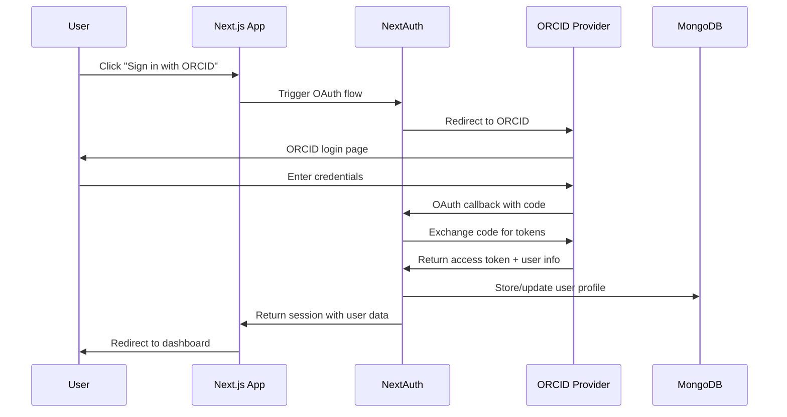

# Backend Architecture

## Service Architecture

### Function Organization

```
apps/workers/
├── ai-evaluation/               # AI evaluation service
│   ├── src/
│   │   ├── index.ts            # Main worker entry point
│   │   ├── evaluators/         # Different evaluation modules
│   │   │   ├── plagiarism.ts   # Turnitin integration
│   │   │   ├── quality.ts      # Content quality analysis
│   │   │   └── structure.ts    # Document structure validation
│   │   ├── queues/             # Queue management
│   │   └── utils/              # Shared utilities
│   └── wrangler.toml           # Cloudflare Worker config
├── document-processor/         # File processing service
│   ├── src/
│   │   ├── index.ts           # Document processing entry
│   │   ├── extractors/        # Text extraction modules
│   │   ├── converters/        # Format conversion
│   │   └── validators/        # File validation
│   └── wrangler.toml
└── notifications/             # Email notification service
    ├── src/
    │   ├── index.ts          # Notification worker
    │   ├── templates/        # Email templates
    │   ├── providers/        # Email service integrations
    │   └── schedulers/       # Scheduled notifications
    └── wrangler.toml
```

### Function Template

```typescript
// AI Evaluation Worker
export default {
  async queue(batch: MessageBatch<any>, env: Env): Promise<void> {
    for (const message of batch.messages) {
      try {
        const { submissionId, serviceType } = message.body;
        
        switch (serviceType) {
          case 'plagiarism-check':
            await processPlagiarismCheck(submissionId, env);
            break;
          case 'quality-analysis':
            await processQualityAnalysis(submissionId, env);
            break;
          default:
            throw new Error(`Unknown service type: ${serviceType}`);
        }
        
        message.ack();
      } catch (error) {
        console.error('Queue processing error:', error);
        message.retry();
      }
    }
  },

  async fetch(request: Request, env: Env): Promise<Response> {
    // Handle HTTP endpoints for manual evaluation triggers
    const url = new URL(request.url);
    
    if (url.pathname === '/evaluate' && request.method === 'POST') {
      const { submissionId, serviceType } = await request.json();
      
      // Add to queue for processing
      await env.AI_EVALUATION_QUEUE.send({
        submissionId,
        serviceType,
        priority: 'manual'
      });
      
      return new Response(JSON.stringify({ success: true }), {
        headers: { 'Content-Type': 'application/json' }
      });
    }
    
    return new Response('Not Found', { status: 404 });
  }
};

async function processPlagiarismCheck(submissionId: string, env: Env) {
  // Fetch submission from database
  const submission = await getSubmission(submissionId, env.DATABASE_URL);
  
  // Submit to Turnitin
  const turnitinResponse = await submitToTurnitin(submission, env.TURNITIN_API_KEY);
  
  // Store results
  await updateSubmissionEvaluation(submissionId, {
    plagiarismScore: turnitinResponse.similarity_score,
    plagiarismReport: turnitinResponse.report_url
  }, env.DATABASE_URL);
  
  // Send notification
  await env.NOTIFICATION_QUEUE.send({
    type: 'evaluation_complete',
    submissionId,
    serviceType: 'plagiarism-check'
  });
}
```

## Database Architecture

### Schema Design

```sql
-- MongoDB collections with Mongoose schemas

// Publisher schema with tenant isolation
const PublisherSchema = new Schema({
  name: { type: String, required: true },
  slug: { type: String, required: true, unique: true },
  subscriptionTier: {
    type: String,
    enum: ['starter', 'professional', 'enterprise'],
    default: 'starter'
  },
  billingInfo: {
    stripeCustomerId: String,
    subscriptionId: String,
    billingEmail: String
  },
  settings: {
    branding: {
      logoUrl: String,
      primaryColor: { type: String, default: '#6366f1' },
      secondaryColor: { type: String, default: '#8b5cf6' }
    },
    defaultLanguage: { type: String, default: 'en' },
    timezone: { type: String, default: 'UTC' }
  }
}, {
  timestamps: true,
  // Ensure all queries include tenant context
  toJSON: { virtuals: true },
  toObject: { virtuals: true }
});

// Add compound indexes for multi-tenant queries
PublisherSchema.index({ slug: 1 });
PublisherSchema.index({ 'billingInfo.stripeCustomerId': 1 });

// Journal schema with publisher reference
const JournalSchema = new Schema({
  publisherId: { 
    type: Schema.Types.ObjectId, 
    ref: 'Publisher', 
    required: true,
    index: true 
  },
  title: { type: String, required: true },
  slug: { type: String, required: true },
  issn: String,
  aiEvaluationSettings: {
    enableInitialScreening: { type: Boolean, default: true },
    plagiarismThreshold: { type: Number, default: 15 },
    aiContentThreshold: { type: Number, default: 10 },
    autoRejectBelow: { type: Number, default: 30 },
    autoAcceptAbove: { type: Number, default: 85 }
  },
  status: {
    type: String,
    enum: ['active', 'inactive', 'archived'],
    default: 'active'
  }
}, { timestamps: true });

// Compound index for publisher + status queries
JournalSchema.index({ publisherId: 1, status: 1 });
JournalSchema.index({ publisherId: 1, slug: 1 }, { unique: true });
```

### Data Access Layer

```typescript
// Repository pattern for data access
import { type Collection, MongoClient } from 'mongodb';

export class SubmissionRepository {
  private collection: Collection<Submission>;

  constructor(private db: MongoClient) {
    this.collection = db.db().collection<Submission>('submissions');
  }

  async findByPublisher(
    publisherId: string, 
    filters: {
      journalId?: string;
      status?: string;
      page?: number;
      limit?: number;
    }
  ) {
    const pipeline = [
      // Join with journals to enforce publisher boundary
      {
        $lookup: {
          from: 'journals',
          localField: 'journalId',
          foreignField: '_id',
          as: 'journal'
        }
      },
      {
        $match: {
          'journal.publisherId': new ObjectId(publisherId),
          ...(filters.journalId && { journalId: new ObjectId(filters.journalId) }),
          ...(filters.status && { status: filters.status })
        }
      },
      {
        $sort: { submittedAt: -1 }
      },
      {
        $skip: ((filters.page ?? 1) - 1) * (filters.limit ?? 20)
      },
      {
        $limit: filters.limit ?? 20
      }
    ];

    const [submissions, totalCount] = await Promise.all([
      this.collection.aggregate(pipeline).toArray(),
      this.collection.countDocuments({
        'journal.publisherId': new ObjectId(publisherId),
        ...(filters.journalId && { journalId: new ObjectId(filters.journalId) }),
        ...(filters.status && { status: filters.status })
      })
    ]);

    return { submissions, totalCount };
  }

  async create(submission: CreateSubmissionInput, publisherId: string) {
    // Verify journal belongs to publisher
    const journal = await this.db.db().collection('journals').findOne({
      _id: new ObjectId(submission.journalId),
      publisherId: new ObjectId(publisherId)
    });

    if (!journal) {
      throw new Error('Journal not found or access denied');
    }

    const result = await this.collection.insertOne({
      ...submission,
      journalId: new ObjectId(submission.journalId),
      authorId: new ObjectId(submission.authorId),
      submittedAt: new Date(),
      status: 'submitted'
    });

    return result.insertedId;
  }
}
```

## Authentication and Authorization

### Auth Flow



### Middleware/Guards

```typescript
// NextAuth configuration with role-based access
export const authOptions: NextAuthOptions = {
  providers: [
    {
      id: 'orcid',
      name: 'ORCID',
      type: 'oauth',
      authorization: {
        url: 'https://orcid.org/oauth/authorize',
        params: {
          scope: '/authenticate',
          response_type: 'code'
        }
      },
      token: 'https://orcid.org/oauth/token',
      userinfo: 'https://pub.orcid.org/v3.0/',
      async profile(profile, tokens) {
        return {
          id: profile['orcid-identifier'].path,
          name: profile.name?.['given-names']?.value + ' ' + profile.name?.['family-name']?.value,
          email: profile.emails?.[0]?.email,
          orcid: profile['orcid-identifier'].path
        };
      }
    },
    GoogleProvider({
      clientId: env.GOOGLE_CLIENT_ID,
      clientSecret: env.GOOGLE_CLIENT_SECRET
    })
  ],
  callbacks: {
    async jwt({ token, user, account }) {
      if (user) {
        // Fetch user roles from database
        const dbUser = await getUserWithRoles(user.id);
        token.roles = dbUser?.roles || [];
        token.publisherId = dbUser?.roles.find(r => r.role === 'publisher-admin')?.publisherId;
      }
      return token;
    },
    async session({ session, token }) {
      session.user.id = token.sub!;
      session.user.roles = token.roles as UserRole[];
      session.user.publisherId = token.publisherId as string;
      return session;
    }
  },
  pages: {
    signIn: '/login',
    error: '/auth/error'
  }
};

// tRPC middleware for role-based protection
export const requireRole = (allowedRoles: string[]) => {
  return middleware(({ ctx, next }) => {
    if (!ctx.session?.user) {
      throw new TRPCError({ code: 'UNAUTHORIZED' });
    }

    const hasRequiredRole = ctx.session.user.roles.some(role => 
      allowedRoles.includes(role.role)
    );

    if (!hasRequiredRole) {
      throw new TRPCError({ code: 'FORBIDDEN' });
    }

    return next({ ctx: { ...ctx, user: ctx.session.user } });
  });
};

// Usage in tRPC procedures
export const editorProcedure = publicProcedure
  .use(requireRole(['editor', 'publisher-admin']))
  .use(requirePublisherAccess);

export const requirePublisherAccess = middleware(({ ctx, next, input }) => {
  // Ensure all operations are scoped to user's publisher
  const publisherId = ctx.session.user.publisherId;
  
  if (!publisherId) {
    throw new TRPCError({ code: 'FORBIDDEN', message: 'No publisher access' });
  }

  return next({ 
    ctx: { 
      ...ctx, 
      publisherId,
      // Override database queries to include publisher filter
      db: createTenantAwareDB(ctx.db, publisherId)
    } 
  });
});
```
