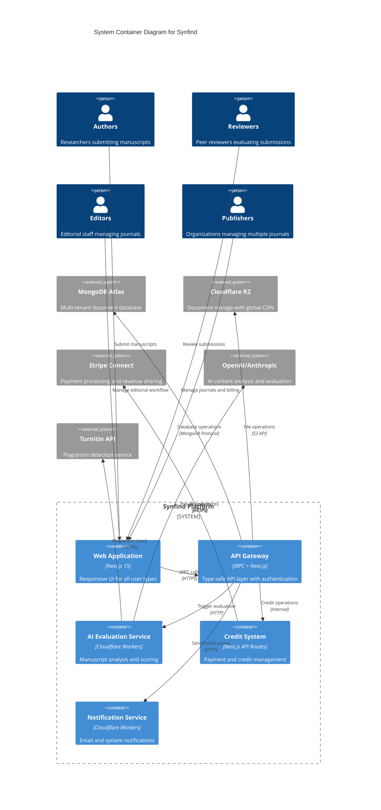

# Components

Based on the architectural patterns, tech stack, and data models defined above, here are the major system components:

## Web Application (Next.js Frontend)

**Responsibility:** User interface for publishers, editors, authors, and reviewers with responsive design and accessibility compliance

**Key Interfaces:**
- tRPC client for type-safe API communication
- NextAuth session management for authentication
- Cloudflare R2 direct upload for large manuscript files

**Dependencies:** Publisher Router, Journal Router, Submission Router, File Router

**Technology Stack:** Next.js 15 App Router, shadcn/ui components, Tailwind CSS, Zustand for client state, TanStack Query for server state

## API Gateway (tRPC + Next.js API Routes)

**Responsibility:** Type-safe API layer handling authentication, authorization, input validation, and business logic orchestration

**Key Interfaces:**
- REST endpoints for webhook integrations (Stripe, external services)
- tRPC procedures for frontend communication
- Database abstraction layer for data operations

**Dependencies:** Database Service, Authentication Service, AI Evaluation Service

**Technology Stack:** tRPC routers, Zod validation, NextAuth middleware, rate limiting with Upstash Redis

## Database Service (MongoDB Atlas)

**Responsibility:** Multi-tenant data storage with publisher isolation, full-text search, and academic metadata management

**Key Interfaces:**
- Mongoose ODM with TypeScript schemas
- GridFS for large document metadata storage
- Atlas Search for manuscript and author discovery

**Dependencies:** None (external managed service)

**Technology Stack:** MongoDB Atlas 7.0+, Mongoose ODM, database indexing strategies for multi-tenant queries

## Document Storage Service (Cloudflare R2)

**Responsibility:** Scalable manuscript and supplementary file storage with global CDN delivery and security controls

**Key Interfaces:**
- S3-compatible API for upload/download operations
- Presigned URLs for direct browser uploads
- Signed URLs for secure reviewer access

**Dependencies:** None (external managed service)

**Technology Stack:** Cloudflare R2, AWS SDK v3 for S3 compatibility, CDN integration for global delivery

## AI Evaluation Service (Cloudflare Workers)

**Responsibility:** Asynchronous AI-powered manuscript evaluation including plagiarism detection, content analysis, and quality scoring

**Key Interfaces:**
- Queue-based job processing for long-running tasks
- External AI API integrations (OpenAI, Anthropic, Turnitin)
- Webhook callbacks to update submission status

**Dependencies:** Document Storage Service, External AI APIs, Database Service

**Technology Stack:** Cloudflare Workers, Queue API, OpenAI/Anthropic SDK, Turnitin API integration

## Authentication Service (NextAuth.js)

**Responsibility:** Multi-provider authentication supporting ORCID, Google, institutional SSO, and role-based access control

**Key Interfaces:**
- OAuth provider integrations
- JWT token management for session persistence
- Role-based middleware for API route protection

**Dependencies:** Database Service for user/session storage

**Technology Stack:** NextAuth.js v5, ORCID OAuth provider, Google OAuth, custom database adapter

## Credit System Service

**Responsibility:** Credit purchase, consumption tracking, revenue sharing calculations, and marketplace transaction management

**Key Interfaces:**
- Stripe Connect API for payment processing
- Credit balance calculations and transaction history
- Service consumption deduction and revenue sharing

**Dependencies:** Database Service, Payment Processing (Stripe)

**Technology Stack:** Stripe SDK, transaction logging, revenue sharing algorithms, credit package configuration

## Notification Service (Cloudflare Workers)

**Responsibility:** Email notifications, system alerts, and communication management for editorial workflows

**Key Interfaces:**
- Email template management and personalization
- Multi-language support for international users
- Event-driven triggers from submission status changes

**Dependencies:** Database Service for recipient management

**Technology Stack:** Cloudflare Workers, email service integration (SendGrid/Resend), template engine

## Component Diagrams

