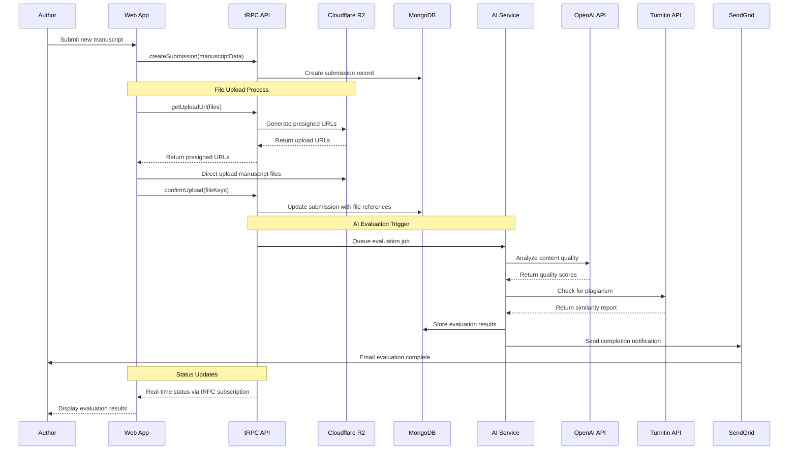
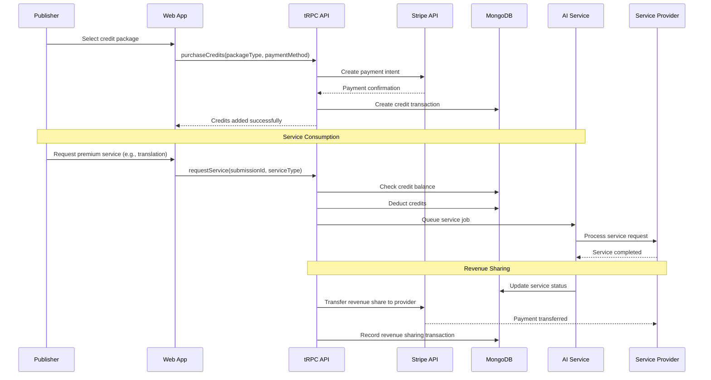
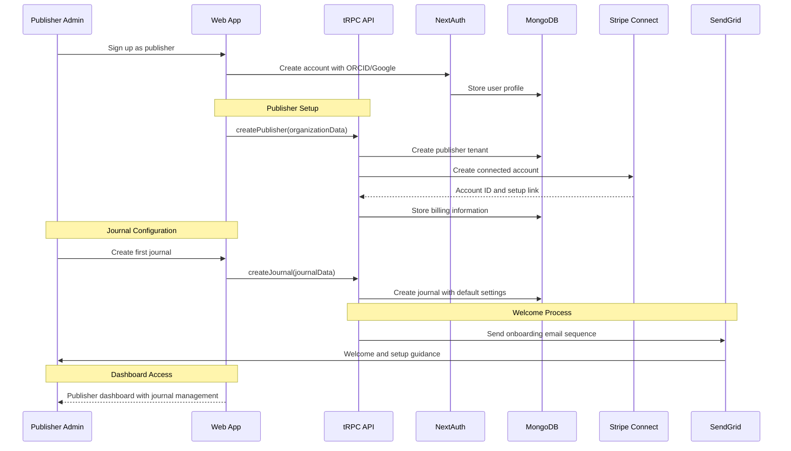
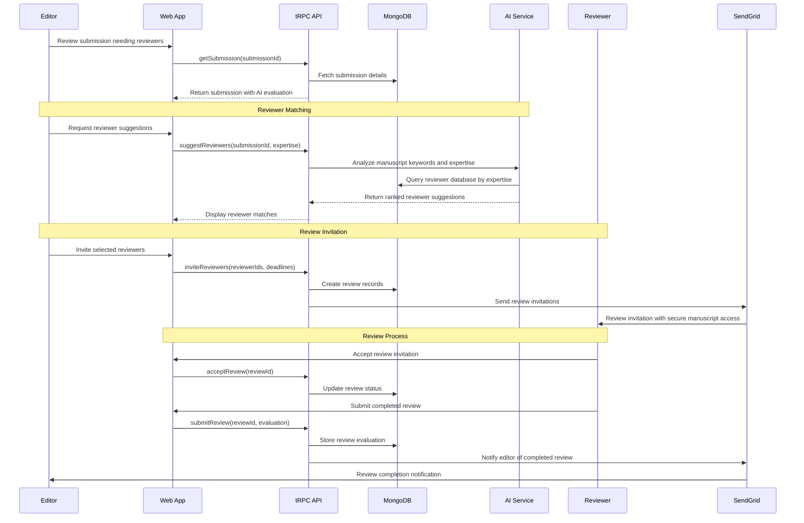
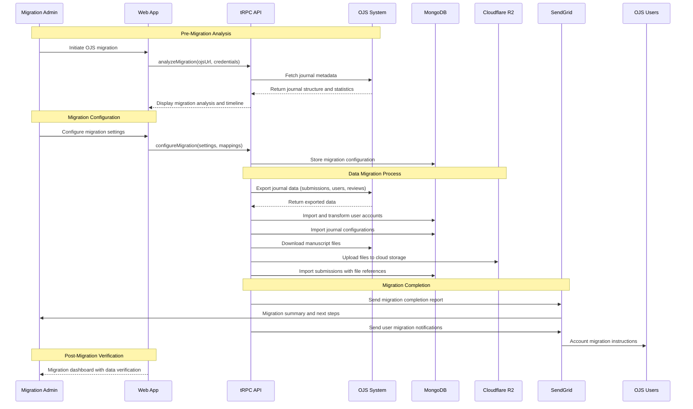

# Core Workflows

Here are the key system workflows that illustrate critical user journeys and component interactions:

## Manuscript Submission and AI Evaluation Workflow

## Credit Purchase and Service Consumption Workflow

## Multi-Tenant Publisher Onboarding Workflow

## Peer Review Assignment and Workflow

## OJS Migration and Data Synchronization Workflow

