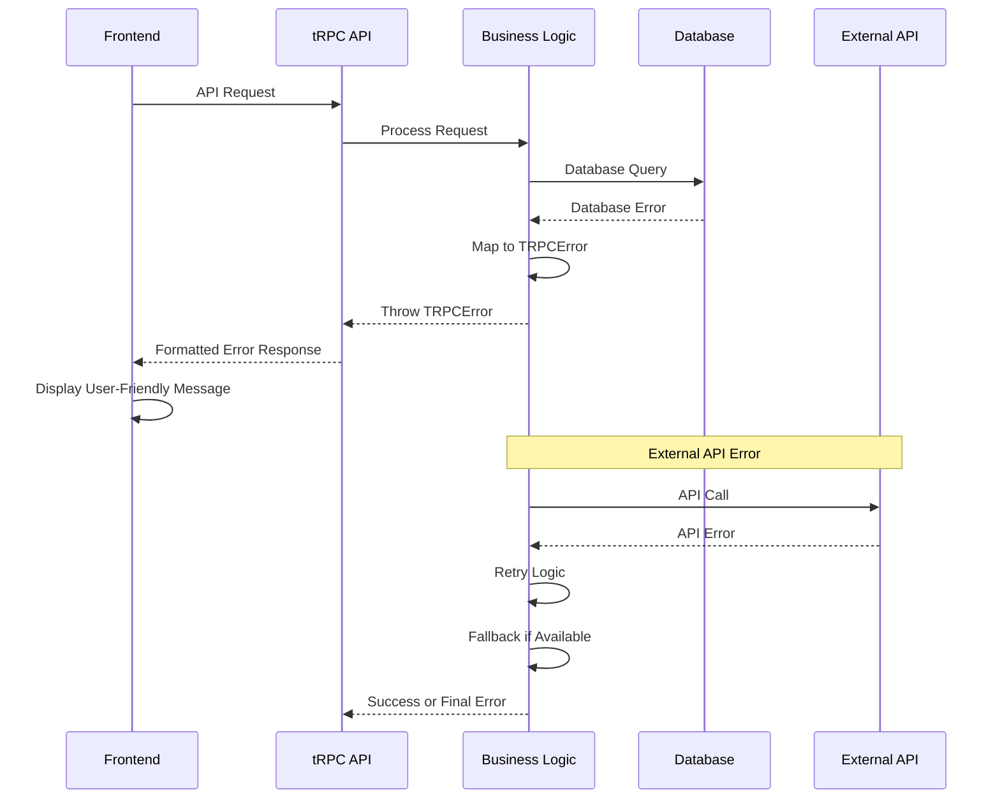

# Error Handling Strategy

## Error Flow



## Error Response Format

```typescript
interface ApiError {
  error: {
    code: string;
    message: string;
    details?: Record<string, any>;
    timestamp: string;
    requestId: string;
  };
}
```

## Frontend Error Handling

```typescript
import { TRPCClientError } from '@trpc/client';
import { toast } from '~/components/ui/use-toast';

export function handleTRPCError(error: TRPCClientError<any>) {
  const errorCode = error.data?.code;
  const errorMessage = error.message;

  switch (errorCode) {
    case 'UNAUTHORIZED':
      toast({
        variant: 'destructive',
        title: 'Authentication Required',
        description: 'Please sign in to continue.',
      });
      // Redirect to login
      window.location.href = '/login';
      break;
      
    case 'INSUFFICIENT_CREDITS':
      toast({
        variant: 'destructive',
        title: 'Insufficient Credits',
        description: 'Please purchase more credits to use this service.',
        action: <Button onClick={() => router.push('/credits/purchase')}>Buy Credits</Button>
      });
      break;
      
    case 'VALIDATION_ERROR':
      toast({
        variant: 'destructive',
        title: 'Invalid Input',
        description: errorMessage,
      });
      break;
      
    default:
      toast({
        variant: 'destructive',
        title: 'Something went wrong',
        description: 'Please try again later.',
      });
      
      // Log error for debugging
      console.error('Unhandled tRPC error:', error);
  }
}

// Hook for consistent error handling
export function useErrorHandler() {
  return {
    handleError: handleTRPCError,
    handleAsyncError: (asyncFn: () => Promise<void>) => {
      return async () => {
        try {
          await asyncFn();
        } catch (error) {
          if (error instanceof TRPCClientError) {
            handleTRPCError(error);
          } else {
            console.error('Unexpected error:', error);
            toast({
              variant: 'destructive',
              title: 'Unexpected Error',
              description: 'Something went wrong. Please try again.',
            });
          }
        }
      };
    }
  };
}
```

## Backend Error Handling

```typescript
import { TRPCError } from '@trpc/server';
import { z } from 'zod';

// Custom error types
export class InsufficientCreditsError extends Error {
  constructor(required: number, available: number) {
    super(`Insufficient credits: ${required} required, ${available} available`);
    this.name = 'InsufficientCreditsError';
  }
}

export class ExternalAPIError extends Error {
  constructor(service: string, originalError: Error) {
    super(`${service} API error: ${originalError.message}`);
    this.name = 'ExternalAPIError';
  }
}

// Error mapping utility
export function mapToTRPCError(error: Error): TRPCError {
  if (error instanceof InsufficientCreditsError) {
    return new TRPCError({
      code: 'BAD_REQUEST',
      message: error.message,
      cause: error,
    });
  }

  if (error instanceof ExternalAPIError) {
    return new TRPCError({
      code: 'INTERNAL_SERVER_ERROR',
      message: 'External service temporarily unavailable',
      cause: error,
    });
  }

  if (error instanceof z.ZodError) {
    return new TRPCError({
      code: 'BAD_REQUEST',
      message: 'Validation failed',
      cause: error,
    });
  }

  // Default to internal server error
  return new TRPCError({
    code: 'INTERNAL_SERVER_ERROR',
    message: 'An unexpected error occurred',
    cause: error,
  });
}

// Global error handler for tRPC
export function createErrorHandler() {
  return (error: Error, req: Request) => {
    // Log error for monitoring
    console.error('tRPC Error:', {
      error: error.message,
      stack: error.stack,
      url: req.url,
      method: req.method,
      timestamp: new Date().toISOString(),
    });

    // Send to error tracking service
    if (process.env.NODE_ENV === 'production') {
      // Sentry or similar error tracking
      captureException(error);
    }

    return mapToTRPCError(error);
  };
}
```
