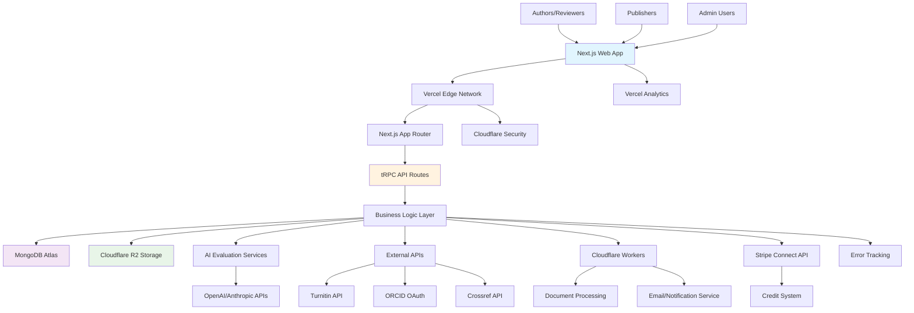

# High Level Architecture

## Technical Summary

Synfind employs a modern serverless-first architecture built on Next.js 15 with App Router, utilizing tRPC for type-safe API communications and MongoDB Atlas for multi-tenant data storage. The frontend leverages shadcn/ui components with Tailwind CSS for rapid, accessible interface development, while the backend implements microservice patterns through Vercel Edge Functions and Cloudflare Workers for document processing. Key integration points include NextAuth v5 for authentication, Cloudflare R2 for scalable document storage, and external APIs for AI evaluation services. This architecture achieves the PRD's goals of supporting 500+ journals by Year 3 through horizontal scaling, credit-based service marketplace through integrated payment processing, and AI-powered evaluation through modular service architecture.

## Platform and Infrastructure Choice

**Platform:** Vercel + Cloudflare + MongoDB Atlas  
**Key Services:** Vercel (hosting/edge functions), Cloudflare R2 (document storage), MongoDB Atlas (database), Stripe (payments), OpenAI/Anthropic (AI services)  
**Deployment Host and Regions:** Global edge deployment via Vercel with primary regions: US-East, EU-West, Asia-Pacific

**Rationale:** This combination provides optimal performance for global academic publishing with edge computing for document processing, enterprise-grade database scaling, and integrated CDN for document delivery.

## Repository Structure

**Structure:** Turborepo monorepo  
**Monorepo Tool:** Turborepo (optimal for Vercel deployment)  
**Package Organization:** Apps (web, api workers), packages (shared types, ui components, database schemas), services (external integrations)

## High Level Architecture Diagram

## Architectural Patterns

- **Jamstack Architecture:** Next.js SSG/ISR with serverless APIs - _Rationale:_ Optimal performance and global scale for content-heavy academic publishing platform
- **Multi-Tenant SaaS Pattern:** Schema-per-tenant with tenant isolation - _Rationale:_ Ensures data privacy between publishers while maintaining operational efficiency
- **Microservices via Serverless:** Domain-specific edge functions and workers - _Rationale:_ Enables independent scaling of AI evaluation, document processing, and business logic
- **Event-Driven Architecture:** Async processing for document analysis and notifications - _Rationale:_ Handles long-running AI evaluation tasks without blocking user interactions
- **Repository Pattern:** Abstracted data access with MongoDB - _Rationale:_ Enables testing and future database optimization while maintaining type safety
- **API-First Design:** tRPC for type-safe client-server communication - _Rationale:_ Reduces integration bugs and improves developer experience in fullstack development
- **Credit-Based Service Pattern:** Transactional service consumption model - _Rationale:_ Enables flexible pricing and revenue sharing with service providers
